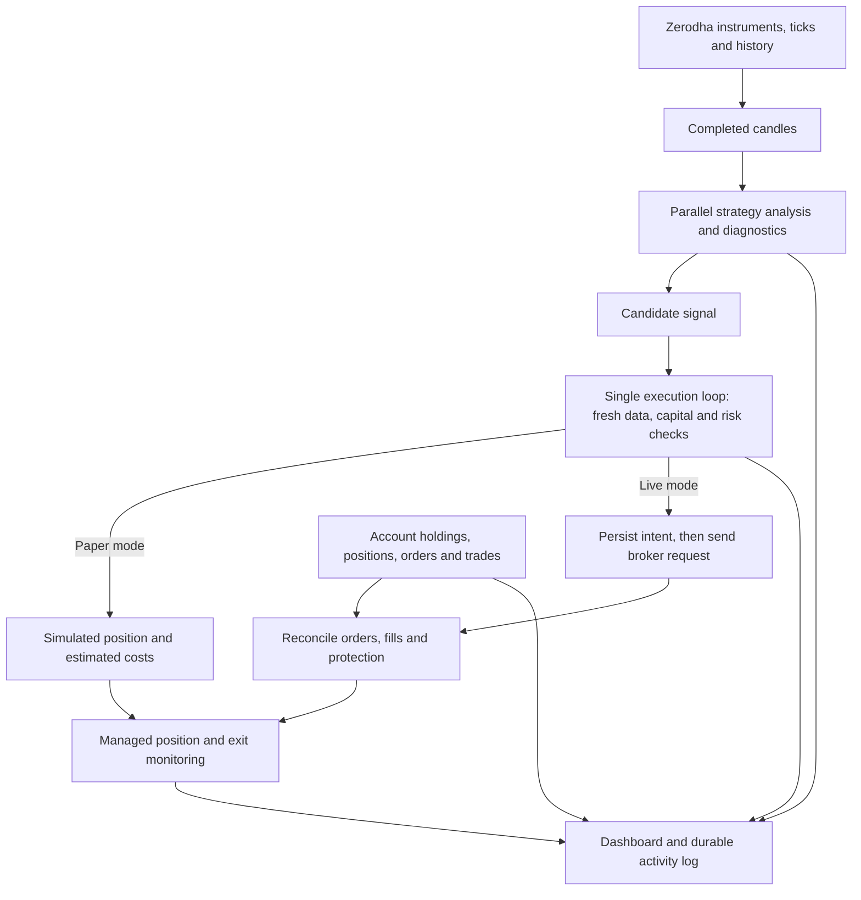

# Trading logic and analytics

This guide describes the rules implemented in StockPilot, including the conditions that prevent a trade. It is a guide to the current source code, not evidence that the strategies make money. The program uses deterministic price and volume rules; it does not learn from trades or predict prices with an AI model.

For installation, environment variables, Cloudflare Tunnel and Zerodha configuration, see the [README](../README.md).

## 1. What happens after Start Trading

1. The server connects to the configured Zerodha account after official authentication. It reads account balances, holdings, positions, orders and executed trades.
2. It downloads the NSE instrument list, opens market-data streams and starts historical candle downloads. Account monitoring begins even when new entries are paused.
3. Start Trading checks configuration, allocations, unresolved orders and the daily loss limit before enabling new entries. Successful login from a Start Trading request also requests this start operation.
4. Completed candles go to CPU workers. Each worker applies the same fixed strategy rules and calculates supporting diagnostics.
5. A qualifying signal becomes a **candidate**, not an order. The single execution loop checks current prices, cash, risk, liquidity, account ownership and other restrictions.
6. An accepted candidate produces either a simulated paper fill or a real broker order. Real positions are derived from confirmed broker fills, not from the original order request.
7. Monitoring, exits, account reconciliation and audit recording continue while the server runs.



The browser and Cloudflare Tunnel provide access to the Node.js server. They do not perform the analysis. Closing the browser, signing out, or losing the tunnel connection does not pause the engine. Stopping the server stops local analysis and exit monitoring. All trading times use India Standard Time regardless of whether the server runs on Windows, macOS or Linux.

Sources: [trading.js](../src/trading.js), [main.js](../src/main.js), [broker.js](../src/broker.js).

## 2. Defaults and scope

| Control | Default | Meaning |
|---|---|---|
| Execution | Paper | Real Zerodha data; simulated strategy trades. |
| Paper capital | Derived from broker cash | The initial virtual budget is persisted; reconnecting does not refill the simulation. |
| Live capital | Derived from broker cash; execution disabled | Live mode and real execution must both be enabled in Settings. |
| Intraday | Enabled; allocation 100% | Initially receives all of the bot's capital allocation. |
| Swing | Disabled; allocation 0% | Overnight buying must be enabled and assigned a positive percentage in Settings. |
| Existing holdings | Selected symbols; selection empty | Holdings are observed; none is initially authorized for automatic selling. |
| Risk per new trade | 0.25% | Fraction of that strategy's allocated capital, including a sizing cost allowance. |
| Maximum new position value | 10% | Fraction of that strategy's allocated capital, including a sizing cost allowance. |
| Maximum positions | 5 | Bot positions and pending intraday entries count; adopted pre-existing holdings are separate. |
| Daily loss threshold | 1% | Fraction of the bot's current capital baseline, based on its estimated daily P&L. |
| Maximum bid/ask spread | 0.3% | `(ask - bid) / ask`. |
| Minimum turnover estimate | Rs 10,000,000 (1 crore) | Today's traded volume multiplied by latest price. |
| Intraday entry cutoff | 14:45 IST | No new intraday buys at or after this time. |
| Intraday exit time | 15:10 IST | Begin requesting exits; this is not a guaranteed completion time. |
| Swing entry cutoff | 15:15 IST | Fixed in the current code. |

Only `KITE_API_KEY`, `KITE_API_SECRET` and `KITE_USER_ID` belong in `.env`. Other controls have defaults and are managed through the dashboard. Risk inputs labeled fraction use `0.0025` for 0.25%; strategy allocation inputs use percentage points, so `100` means 100%. Intraday and swing percentages together cannot exceed 100%. A positive allocation is required for each enabled buying strategy; swing never enables itself because cash increased.

Cash-derived capital and these percentages determine the rupee budgets used by the formulas below. Strategy and existing-holding settings apply without a restart, after entries are paused and managed exposure/pending orders are resolved. Application settings such as mode, risk, worker capacity, port and data directory require the same exposure checks followed by a server restart. Administrator password/key changes revoke dashboard sessions without changing trading permission.

### Where capital comes from

The engine reads verified broker cash information after authentication. It does not treat the market value of existing holdings, collateral, or available leverage as cash to deploy. Before any live entry, current available cash is checked again independently of the strategy budget.

Using `margins.equity.available`, the conservative cash calculation is:

```text
cash = available.cash, default 0
balance = available.live_balance, falling back to margins.equity.net then 0
spendable_cash = max(0, min(cash, balance - collateral - adhoc_margin))
```

Missing collateral/adhoc margin default to zero. Any nonfinite input makes this calculation return zero. The UI shows zero trading capital before verified funding information is available.

Zero available cash blocks new buys but does not prevent starting exit management for authorized eligible existing holdings or already managed exposure. Start still verifies the current account; stale prices or unresolved orders still block decisions. The daily-loss comparison is applied only when the bot has a positive capital baseline.

Paper mode initializes its virtual starting capital from available account cash once and saves that baseline with its simulated positions and P&L. Subsequent login, browser refresh and server restart do not reset paper losses, refill simulated cash or replace the initial balance with the current real account balance.

Live mode establishes its allocation baseline from available cash when starting/reconnecting without owned exposure or unresolved orders. While exposure or pending intents remain, recovery retains the established budget rather than adding share notional to reported free cash; a leveraged cover order could otherwise overstate deployable funds. Budget refresh accounts for previously included realized P&L so it is not counted twice in equity reporting. Zero available cash prevents new purchases but does not disable monitoring of existing shares.

When an older live journal has exposure but no recorded capital baseline, recovery takes the greater of verified cash and the bot's recorded notional exposure as the initial risk baseline; it never adds them together. Every new buy still passes the independent cash limit. Older paper journals without a stored baseline initialize from current cash while retaining their positions and recorded P&L. Legacy rupee allocations are converted to proportions of their combined amount, so review Settings before resuming; the old manually configured capital is not carried forward as a funding source.

Source: capital refresh and strategy allocation logic in [trading.js](../src/trading.js).

The universe is the broker's current instrument list filtered to `exchange=NSE`, `segment=NSE`, `instrument_type=EQ`. This can include ETFs and other instruments classified as EQ; it is not a manually curated list of ordinary company shares. The strategy is **long-only**: buys establish positions and sells close owned shares. It does not open short positions or trade derivatives.

All matching instruments are subscribed, up to the implemented limit of 9,000 instruments across three streams of at most 3,000. Empty or larger universes block connection setup. Subscription does not imply eligibility to trade: warmup, turnover, spread, broker permissions and the other gates still apply.

Sources: [config.js](../src/config.js), `TradingEngine.connect`, `strategy_settings`, `_enter_locked` in [trading.js](../src/trading.js).

## 3. Market data and candle construction

### Time and freshness

Trading decisions use India Standard Time. The regular-session check is Monday to Friday, 09:15 inclusive to 15:30 exclusive. There is no authoritative exchange holiday or special-session calendar in the program. Fresh exchange data is required in addition to the clock check.

- Stream ticks need a valid positive last price and an exchange timestamp within 10 seconds of the server clock.
- New entries require the instrument's latest accepted quote to have arrived within 10 seconds and the account snapshot to be at most 45 seconds old.
- Account reconciliation runs approximately every 15 seconds, plus wakeups from order notifications. REST work can lengthen this interval.
- Delivery operations perform additional broker quote checks, normally allowing up to 30 seconds of quote age; stream hints require both exchange and receive timestamps within 10 seconds.
- CPU results are discarded if they belong to an older connection/day generation, a superseded candle, or were queued more than 30 seconds ago. Candidates also expire after 30 seconds in the execution queue.

WebSocket order updates and validated postback notifications prompt reconciliation. A notification alone is never accepted as proof of a fill; the engine verifies broker order/account state.

### Five-minute candles

Each instrument has a book of up to 80 completed five-minute candles, plus one forming candle. Prices form open/high/low/close; volume is derived from changes in the day's cumulative traded volume.

The first candle observed after subscribing is treated as partial. For live-observed candles, the builder requires consecutive buckets, a tick near the start of the candle and an observation within the last 30 seconds before its close. It clears the completed sequence when that continuity test fails. Out-of-order ticks are ignored; zero-volume updates do not change an already forming candle's OHLC. A new trading date clears the live candle sequence.

Historical warmup loads **completed candles from the current session only**, prioritizing managed positions and then current turnover. It merges valid, finished bars with the book and excludes the currently forming candle. It does not invent missing intervals. The intraday strategy separately requires its latest 21 bars to be exactly five minutes apart.

Twenty-one bars represent 105 minutes: even with complete history from 09:15, this rule cannot qualify before about 11:00. A late start, data gaps and download timing can make qualification later. Historical seeding, Start/Resume and completion of recovery can queue analysis of the latest usable completed candle without waiting another full interval. That intraday candle must belong to today, be complete, and have closed less than five minutes ago. Normal candle closes queue subsequent analysis. Execution still requires fresh current quotes and completed account recovery.

### Daily candles

Daily history requests cover approximately 160 calendar days, ending before today's session. Today's unfinished daily candle is excluded. Data is cached in the database for the current date.

- With swing disabled, history is loaded for existing NSE holdings and managed swing/delivery positions.
- With swing enabled, history is loaded for the whole subscribed universe; holdings and managed delivery exposure are prioritized first, then current turnover.
- The main history loader requires at least 21 daily bars for holdings/managed delivery analysis and 55 for other swing candidates. The latest bar must be no more than seven calendar days old.
- A holdings series with 21–54 bars can support exit analysis but cannot qualify for a new swing breakout, which always requires 55 bars.
- Large daily discontinuities invalidate the relevant calculations rather than being interpreted as ordinary trend changes. This is a guard, not full corporate-action adjustment.

Daily analysis is normally queued on the first fresh tick for an instrument after its daily history is ready. Start/Resume also queues available history for instruments with fresh quotes. Reconnect clears old in-memory series and queued decisions before rebuilding current coverage; the date-keyed historical cache can still supply valid daily bars. Failed downloads remain eligible for a later history pass.

Historical downloads share the serialized REST adapter with account and order calls: calls start at least 0.36 seconds apart, and quote calls at least 1.05 seconds apart. A cold full-universe download therefore takes substantial time even on a large machine. Scanner coverage grows progressively; CPU capacity does not bypass broker rate limits.

Sources: `CandleBook` in [strategy.js](../src/strategy.js); `_on_ticks`, `_history`, `_intraday_history`, `_seed_intraday` in [trading.js](../src/trading.js).

## 4. Exact entry rules

Here `O`, `H`, `L`, `C`, and `V` mean candle open, high, low, close and volume. `SMA(n)` is the arithmetic mean of the latest `n` closes. All windows below include the last completed candle unless explicitly described as previous candles.

### ATR used by both strategies

For each candle after the first:

```text
true_range = max(H - L, abs(H - previous_close), abs(L - previous_close))
ATR14 = arithmetic mean of the latest 14 true ranges
```

This is a simple average, not Wilder's smoothed ATR. It requires at least 15 bars; otherwise the helper returns zero.

### Intraday breakout

The latest 21 completed five-minute candles must pass **every** condition:

1. All 21 are consecutive five-minute bars.
2. Latest close is strictly above the highest high of the preceding 20 bars.
3. Latest volume is at least 1.5 times the average volume of those preceding 20 bars; that average must be positive.
4. `SMA(5) > SMA(20)`.
5. Latest range `H - L` is positive, `(C - O) / (H - L) >= 0.60`, and `(H - C) / (H - L) <= 0.20`. This requires a strong bullish body and a close near the high.
6. Define `R = max(1.5 × ATR14, 0.004 × C)`. Reject if `R / C > 0.025`.

A passing signal has reference price `C`, stop `C - R`, target `C + 2R`, and score `min(10, V / average_previous_volume)`.

### Swing breakout

The strategy takes the latest 55 completed daily bars and requires:

1. No consecutive pair in those 55 bars has `abs(next_open / previous_close - 1) > 0.20`.
2. Latest close is strictly above the highest high of the preceding 20 daily bars.
3. `SMA(20) > SMA(50)`.
4. Latest volume is at least 1.5 times the preceding 20-bar average, which must be positive.
5. Latest candle has positive range, `C > O`, and `(H - C) / (H - L) <= 0.25`.
6. Define `R = max(2 × ATR14, 0.02 × C)`. Reject if `R / C > 0.08`.

A passing signal has reference price `C`, stop `C - R`, target `C + 2.5R`, and the same relative-volume score capped at 10.

The score is not a probability, confidence estimate or tested ranking model. Candidates are processed as analysis completes, not sorted by score. Extra RSI or regression metrics do not override failed entry rules.

Stops and targets above are generated from the completed candle's close. Actual order pricing and tick rounding can change the distance from the executed entry, so the final realized reward/risk ratio need not equal 2 or 2.5.

Source: `atr`, `intraday_signal`, `swing_signal` in [strategy.js](../src/strategy.js).

## 5. Additional CPU analytics: what affects a trade

Workers calculate these diagnostics alongside the rules. They are attached to signal records for inspection. **The current entry decision uses the rules in section 4, not thresholds on this diagnostic table.**

| Diagnostic | Calculation and interpretation |
|---|---|
| `rsi14` | Latest 14 close changes: average positive change divided by average negative change in the usual `100 - 100/(1 + gain/loss)` formula. Uses available changes when fewer than 14 exist; no smoothing. No losses gives 100 when gains exist, otherwise 50. |
| `atr14` | The simple-average ATR described above. |
| `return_volatility` | Population standard deviation of simple close-to-close returns `next_close / prior_close - 1`. A fraction per candle, not annualized volatility. |
| `trend_slope_pct` | Ordinary least-squares slope of closes against bar index, divided by last close and multiplied by 100. Percent of last price per bar. |
| `trend_r_squared` | Squared correlation of bar index with closes, measuring fit to a straight line; zero for a degenerate/flat series. It is not a forecast accuracy estimate. |
| `efficiency_ratio` | `abs(last_close - first_close) / sum(abs(each_close_change))`; zero if the path does not move. |
| `candle_body_ratio` | `abs(C - O) / (H - L)` for the last bar, with a tiny denominator floor. This diagnostic is unsigned; the intraday entry rule uses a signed bullish body. |
| `upper_wick_ratio` | `(H - max(O, C)) / (H - L)` for the last bar, with the same floor. |

Except for ATR/RSI's short windows and the last-candle metrics, diagnostics use the full supplied series: up to 80 intraday bars or the available daily history. Strategy rules use their specified 21/55-bar slices, so diagnostic windows are not all identical to entry windows.

Automatic worker capacity is `max(1, logical_CPU_count - analytics_reserve_cpus)`, with a default reserve of four. A positive analytics-worker value in Settings sets a ceiling capped at the logical CPU count. On the detected 192-logical-CPU machine, the automatic ceiling is 188 workers.

Analytics uses Node.js `worker_threads` on all supported platforms. Workers are created only when concurrent batches need them and retire after 60 seconds idle. Each normally analyzes 32 instrument/strategy records; batch size is limited to 1–256. The worker's V8 heap budget is 64 MB old generation plus 16 MB young generation, with a 4 MB stack; total process memory also includes worker/runtime overhead. This is a calculation-capacity ceiling, not a request to occupy every core permanently.

A newer pending bar replaces an older queued bar for the same instrument and strategy. The dispatcher limits concurrent batches to the worker ceiling; the pool also bounds its accepted backlog. Analytics workers receive candles, not broker credentials or database connections. Results preserve the input candle time and generation so the execution service can reject stale results.

Market-data sockets use up to three separate feed workers, each with at most 3,000 instruments. They are separate from the analytics pool. The installed official KiteTicker SDK shares socket state within a JavaScript module, so putting each connection in its own isolate keeps its subscription and reconnection state independent. REST requests remain in the coordinated broker adapter and are not multiplied by the CPU worker count.

Low CPU usage while waiting for ticks or REST history is expected. The system does not create artificial load. **Only one application execution process sends orders**, regardless of analytics worker count.

Source: [analytics.js](../src/analytics.js), `_analysis_loop` and `_analysis_finished` in [trading.js](../src/trading.js).

## 6. From candidate to quantity and order

A candidate can be rejected even when its chart pattern is valid. The execution gates check:

- Trading is enabled, the strategy has a valid positive allocation, the session is open, and its entry cutoff has not passed.
- No maintenance lock, unresolved order/protection problem, or daily loss breach prevents entries.
- Account and instrument quotes are fresh; a symbol is not already a bot position, an outstanding intent, or traded by the bot today.
- Bot position capacity is available. In live mode, an existing account position, holding, or nonterminal order for the same symbol also prevents a new buy.
- Best bid and ask exist and are positive; ask is not below bid; spread is at most the configured limit.
- `today_volume × last_price` meets the turnover threshold. This is an estimate, not the actual sum of all traded prices times quantities.
- Current ask is within 0.5% of the intraday signal reference or 2% of the swing reference, in either direction.
- Enough capital, risk budget, cash and visible best-ask quantity are available.

The planned entry is `ask × 1.0005`, rounded **up** to the instrument's tick size. The stop is rounded **down** to a tick. The 0.05% entry adjustment accommodates price movement, but a real limit order can still remain unfilled or partially fill.

Let `A` be strategy allocation, `F` remaining spendable budget, `E` rounded entry and `S` rounded stop. Position sizing is:

```text
per_share_risk = E - S + 0.002 × E
quantity = floor(min(
    A × risk_per_trade_pct / per_share_risk,
    A × max_position_pct / (E × 1.001),
    F / (E × 1.001)
))
```

Nonfinite values, invalid prices, nonpositive budget or quantity below one prevent the order. The extra 0.2% in per-share risk budgets estimated entry and exit costs; the 0.1% in purchase value budgets entry costs.

Remaining budget is limited by the strategy's unused percentage allocation and the current capital baseline, reduced for realized losses since that baseline and current/pending exposure. A live baseline refresh while flat can reflect changed account cash; an open position's profit does not silently enlarge its budget. Live cash is additionally bounded by reported cash and live balance after excluding collateral/adhoc margin and reserving bot notional exposure. The program reserves full purchase notional even if the broker would offer leverage.

The best ask's displayed quantity must cover the entire requested quantity; depth across multiple levels is not aggregated for this check. Combined planned stop distance risk for current bot positions, pending intraday entries and the proposed trade must not exceed `capital_baseline × daily_loss_pct`. This planned-distance calculation excludes fees and cannot cap actual losses during price gaps. Existing holdings are outside this bot-risk budget.

Sources: `position_size` in [strategy.js](../src/strategy.js); `_enter_locked`, `_exposure` in [trading.js](../src/trading.js).

## 7. How orders and exits work

### Paper mode

Paper mode uses real market data and account reads but does not place broker orders. A passing buy is filled immediately at the adjusted, rounded entry price. This is a simplified model: no order queue, broker rejection or partial-fill simulation is performed.

A bot position exits when a fresh last price reaches its stop or target. Intraday positions also request exit at 15:10; the daily loss rule or Close managed positions can request exits too. A simulated sale requires an open session, a quote received within 10 seconds and a positive bid. Its fill price is `bid × 0.9995`. Stale data causes the exit to wait instead of fabricating a fill at the stop price.

Estimated costs are 0.1% of buy value plus 0.1% of sell value. These are fixed allowances, not actual brokerage, tax or contract-note calculations.

**Paper swing positions currently use the fixed initial stop and target.** They do not run the live delivery manager's daily trailing/trend exits or GTT lifecycle. Paper existing-holding exits are separate shadow actions described below. Paper results therefore do not fully simulate live delivery behavior.

### Live intraday

The engine submits a BUY limit **Cover Order**, product MIS, with a stop trigger so the broker creates the protective second leg. It does not substitute an unprotected standalone buy when a cover order is unavailable.

- The intended order and unique tag are saved before submission.
- Reconciliation matches the parent order and children and derives owned quantity as confirmed buy fills minus confirmed sell fills.
- Partial entry fills count only when confirmed. The engine checks that active protective sell quantity covers remaining shares.
- A still-open entry older than 30 seconds receives a cancellation request; an unresolved exit older than 30 seconds produces an attention/error state.
- Stop, target, daily-loss and timed exits request cancellation/exit through the cover-order mechanism. The program does not send an independent extra SELL that could compete with the cover child.
- The profit target and timed exit are local software decisions. The cover stop is broker-held. Server downtime prevents local target/time monitoring.

Unknown acknowledgements, missing protection, duplicate tag matches or differences between the broker's net quantity and the journal pause new entries for reconciliation. A timeout is not treated as proof that an order failed.

### Live swing and delivery

New swing buys require enabled/funded swing settings and verified demat authorization. The implementation checks broker profile `meta.demat_consent == "physical"` for unattended DDPI/POA access; a local checkbox is not treated as proof. Current-day TPIN/OTP authorization does not satisfy this new-buy requirement because an overnight position may need to exit on a later day.

1. Preflight checks existing delivery exposure/orders, other GTT triggers, fresh broker quotes and allocation.
2. A durable intent precedes a regular CNC **IOC LIMIT** buy. IOC means any immediately unfilled remainder is cancelled by the order's validity rules.
3. The engine waits for a terminal order outcome and protects only its confirmed filled quantity.
4. A broker GTT is created with stop and target legs. Its stop sell limit is the stop trigger times `0.995`, rounded down, subject to the current lower circuit limit; the target sell limit is the target price rounded up to a tick.
5. GTT identity, quantities and associated exchange fills are repeatedly reconciled.

The entry and GTT are **not atomic**. Shares can be filled before protection is confirmed. Failure or ambiguity blocks new entries and is surfaced for attention. A GTT trigger creates a limit order; it does not guarantee a sale through a gap, circuit restriction or insufficient liquidity.

In addition to the original stop/target, live swing positions receive the daily trend/trailing checks in section 8. The trailing level is local software state: the code does **not** continually modify the original broker GTT upward. Local monitoring must run for that additional trailing exit to act.

For an explicit delivery exit, the engine resolves earlier orders and verifies current delivery authorization before disarming its GTT. Missing authorization leaves an existing protective trigger intact while the dashboard prompts the user. Once authorized, it verifies whether the GTT triggered during cancellation, accounts for resulting fills, refreshes holdings and sells only the remaining verified quantity using a CNC IOC limit order. An unknown cancellation, competing external order/GTT or unresolved prior exit prevents an additional sell. After a terminal partial exit, a later evaluation can request the remaining shares; it does not blindly repeat the original quantity.

Sources: [broker.js](../src/broker.js), `_exit_locked` and `_reconcile_live_locked` in [trading.js](../src/trading.js), [delivery.js](../src/delivery.js).

## 8. Existing holdings and daily exit analysis

All account holdings are shown in the account view. Available NSE holdings with suitable history receive exit analysis even when swing buying is disabled. **Permission to sell existing holdings is separate from permission to buy new swing positions.**

In Settings, choose selected symbols or all existing NSE holdings. The default selection is empty. Live adoption happens only while trading is running. Previously adopted holdings and existing live swing positions continue exit monitoring when new entries are paused.

For live adoption, the engine requires suitable daily history, positive ATR, verified DDPI/POA or sufficient current-day electronic authorization, no competing external CNC order or unresolved GTT, and free settled CNC shares. Available quantity is:

```text
max(0, settled_quantity - used_quantity - collateral_quantity)
```

T1 quantity is not added. Discrepant and non-CNC holdings are excluded. New swing buying does not need to be enabled and no new swing capital is required to manage already-owned shares. Selection permits the eligible available quantity to be adopted, not a user-specified partial lot.

The live delivery evaluator rejects stale daily series, invalid recent prices, recent daily gaps longer than seven calendar days and open-to-prior-close discontinuities above 20%. Its daily exit conditions are:

```text
new_trailing_reference = highest_close_of_latest_20_days - 3 × ATR14
trailing_stop = round_down_to_tick(max(previous_trailing_stop, new_trailing_reference))

trend_exit = (latest_completed_daily_close < SMA20)
             AND (SMA5 < SMA20)

request_exit if trend_exit OR current_price <= trailing_stop
```

For new swing positions the initial stop is the minimum starting reference for that ratchet. An adopted existing holding starts from the 20-day close/ATR reference, bounded below by one tick. When protection is established, existing holdings use a single initial protective GTT stop and no profit target. A holding already meeting an exit condition can go directly to an explicit exit instead. Its average acquisition price is retained for reporting; an exit can crystallize a gain or a loss.

The main loop normally evaluates holdings about once per minute during the regular session, increasing to about once every five seconds while recovery is incomplete; actual timing is affected by broker requests. A daily trend condition is based on completed days, so it can initiate a sale during today's session without waiting for today's close.

In paper mode, selected holdings generate at most one shadow sale per symbol/day when an exit condition and a fresh bid exist. The shadow price is `bid × 0.9995`. Actual holdings stay unchanged and these actions do not enter bot equity or bot realized P&L. The paper holdings reference is recomputed from history, rather than using the live manager's persisted trailing ratchet.

The dashboard's holdings analysis is an explanation of the daily signal; the live manager can still defer an exit because authorization, ownership, GTT state or executable quotes are unsuitable. Inspect the associated activity and order state before treating a signal as an executed sale.

### Electronic authorization for existing shares

Before adopting existing shares, establishing delivery protection or requesting a fresh delivery sale, the manager reads the broker profile. Verified DDPI/POA permits unattended delivery execution. For an account using electronic consent, it reads fresh holdings and requires a valid `authorised_date` matching the current IST date. Its conservative available authorization is:

```text
authorized_available = max(0, min(available_settled_quantity,
                                  authorised_quantity - used_quantity))
```

Invalid dates/quantities or a prior-day authorization provide no usable authorization. Available settled quantity still excludes used and pledged shares. Insufficient authorization creates a durable request containing the symbol, quantity and reason, and places recovery in `awaiting_authorization`. New entries wait; account monitoring and other eligible managed exits continue. Requests remain limited to holdings permitted in Settings and already managed delivery positions.

The dashboard's **Authorize holdings** button obtains a Kite authorization request for up to 100 ISIN/quantity pairs and opens `https://kite.zerodha.com/connect/portfolio/authorise/holdings/...`. TPIN and OTP are entered only on Zerodha/CDSL; the app has no inputs or storage for them. The app receives an authorization request ID, not a sale acknowledgement. If this flow is unavailable, the user can authorize through **Kite → Holdings → Authorise**, then use **Check authorization** in the dashboard. More than 100 requested holdings require successive batches.

Returning to the dashboard initiates a broker-state check. The explicit **Check authorization** button also refreshes account/profile data. A browser success page does not prove usable consent: the current date and remaining broker quantity must pass again. A well-formed Kite HTTP 428 error without any order/trigger acknowledgement is treated as an authorization rejection with no confirmed fill. It remains blocked until the user explicitly selects Check authorization and the fresh broker data passes; background polling cannot repeatedly retry an unchanged rejected sale. Network timeouts, malformed errors and ambiguous acknowledgements retain the normal unknown-outcome reconciliation behavior.

Verification invalidates old decisions and requests a fresh holdings evaluation. It does not submit an order, replay the previous exit signal, enable a paused engine or expand the selected holdings. An exit still needs its current reason, quantity, ownership, market session and executable price checks.

Electronic consent must be renewed for a later trading day. The manager checks current consent even for an already active GTT; the trigger's existence does not guarantee that a future sell will be authorized. If the app is offline, it cannot obtain consent or display a new prompt. Newly automated swing buys retain the DDPI/POA requirement described above. Normal intraday cover orders and simulated paper holdings do not request electronic demat authorization. [Kite holdings authorization](https://kite.trade/docs/connect/v3/portfolio/#holdings-authorisation), [Zerodha authorization validity](https://support.zerodha.com/category/trading-and-markets/trading-faqs/general/articles/validity-of-cdsl-tpin-authorisation), [sell GTT rejection rules](https://support.zerodha.com/category/trading-and-markets/charts-and-orders/gtt/articles/why-was-my-sell-gtt-order-rejected).

Sources: `_analyze_holdings`, `_reconcile_authorization` in [trading.js](../src/trading.js); `_holding_available`, `_delivery_authority`, `_daily_bars`, `evaluate_holdings`, `request_exit` in [delivery.js](../src/delivery.js); [holdings-authorization.js](../src/holdings-authorization.js).

## 9. Equity, P&L and loss limits

The account view shows real Zerodha holdings, balances, positions, orders and trades, including manual activity. The strategy equity chart describes the bot allocation, not total account wealth.

```text
bot_unrealised = sum((last_price - entry_price) × remaining_quantity - estimated_entry_fee)
bot_equity = capital_baseline + realised_since_capital_baseline + bot_unrealised
daily_bot_pnl = cumulative_bot_realised - day_start_realised
                + bot_unrealised - day_start_unrealised
```

Open-position unrealized P&L deducts the estimated entry fee, but not a future exit fee. Realized bot P&L deducts the fixed 0.1% allowance on both sides. Real live order prices/quantities come from confirmed fills, but these cost figures are still estimates.

At a trading-date change the engine records a new baseline, clears its traded-today list and pauses new entries. On reconnect/Start, rollover happens before newly reconciled fills are applied, so discovered fills are not silently absorbed into the new baseline. The unrealized baseline still uses the engine's latest known prices at rollover; it is not a separately obtained official opening valuation. After a long outage, newly discovered historical fills can therefore affect the recovery day's estimated P&L. This is conservative bot risk accounting, not a reconstruction of broker daily statements.

When daily bot P&L is at or below `-capital_baseline × daily_loss_pct`, the engine stops new entries and requests exits for bot positions. Adopted pre-existing holdings are not part of this bot P&L or automatic daily-loss liquidation; their own exit rules and Close managed positions still apply. Price gaps, stale data and order failures can produce losses beyond the threshold.

Delivery reporting separates `bot_realised_pnl` from `existing_holdings_realised_pnl`. Existing-holding sales use the broker-reported average price and estimated costs for reporting; this is not tax-lot accounting. Paper and live bot journals are stored separately. Switching to paper does not resolve existing live exposure: the app blocks starting paper trading while unresolved saved live risk remains.

Sources: `_unrealised`, `_daily_pnl`, `_roll_day`, `_sync_delivery`, `snapshot` in [trading.js](../src/trading.js); `snapshot`, `_realised` in [delivery.js](../src/delivery.js).

## 10. Controls, recovery and logs

| Action/state | Actual behavior |
|---|---|
| Start/Resume trading | Arms enabled strategies after reconciliation and preflight. A buy still needs a qualifying candle and all execution gates. |
| Pause entries | Stops new buys, requests cancellation of pending live entries, and continues account monitoring and exits for already managed positions. It does not sell everything immediately. |
| Close managed positions | Pauses entries and requests exits for bot positions plus already adopted live existing holdings. Unselected/unadopted holdings are excluded. Open session, fresh executable data and unambiguous ownership are still required. |
| Browser logout/close | Dashboard access ends; engine trading state is unchanged. |
| Graceful server shutdown | Invokes Pause, including cancellation requests for pending live entries, then stops local monitoring. Protection on confirmed fills remains at the broker. It is not an automatic liquidation action. |
| Abrupt machine/process shutdown | Local monitoring stops without the opportunity to cancel pending entries. Broker orders/GTTs can continue independently; reconnect and reconcile their actual outcomes. |
| Server restart | Reloads durable journals and tries to restore monitoring with the saved encrypted broker session. It verifies current account state and rebuilds market context. New entries remain paused until Start Trading and cannot pass the recovery gate until existing risk is understood. |
| Session expired | New entries halt; reconnect to Zerodha. Local authenticated operations cannot be assumed available until reconnection. |
| Holdings authorization needed | New entries wait while managed exposure remains monitored. Complete the official Zerodha/CDSL flow, then verify current broker consent; missing consent prevents affected delivery execution. |
| Unknown order/GTT outcome | Reconcile before sending another potentially duplicate mutation; new entries remain blocked where journal uncertainty persists. |

### Recovery after an outage or a later login

Saved positions describe what the server last knew; they are not accepted as the current account without verification. Reconnect checks the authenticated broker profile, retrieves current balances/holdings/positions/orders/trades, reconciles journaled fills and protection, refreshes the instrument list and remaps managed symbols to current instrument tokens. Old queued candidates and analysis results are invalidated. Start/Resume also refreshes the account and restarts the recovery checks rather than replaying an old buy signal.

The dashboard exposes recovery phases such as reconciling, warming up, awaiting authorization, blocked and ready. Where managed exposure exists, the gate requires fresh market prices; delivery exposure also needs completed daily history and a successful exit re-evaluation. Selected existing holdings enter this requirement only when they have eligible available shares; wholly used/pledged, discrepant and non-CNC holdings do not qualify for adoption. Merely downloading candles or returning a waiting status does not complete that evaluation. New entries cannot pass until recovery is ready. Existing exit monitoring runs before new entry processing, including while entries are paused. A market-stream disconnect invalidates queued decisions and returns recovery to warmup so managed exposure needs fresh prices again.

| Time when monitoring resumes (IST, default cutoffs) | What the engine can do |
|---|---|
| Before 09:15 on a weekday | Reconcile the account and prepare daily history. No regular-session trades. Managed shares may remain in warmup until fresh regular-session quotes arrive. |
| 09:15–14:44 | Reconcile and handle existing risk first. New enabled strategies may trade only after recovery, candle warmup and all normal gates. Intraday warmup still prevents a breakout entry before about 11:00. |
| 14:45–15:09 | No new intraday buys. Existing intraday exits remain active; enabled swing buys can still qualify before 15:15. |
| 15:10–15:14 | Request closure of remaining bot intraday positions. New intraday buys stay blocked. Swing entries still require the full recovery/risk gates and their later cutoff. |
| 15:15–15:29 | No new intraday or swing buys. Continue eligible managed exits and account reconciliation. |
| At/after 15:30, weekends or absent fresh session data | No regular-session entry or simulated fill is invented. Broker-side state is reconciled; executable exits wait for an eligible session and the required data. Broker orders/GTTs remain subject to their own lifecycle. |

An intraday position still recorded from an earlier date is treated as overdue when the market is open; the engine requests its exit before considering new buys. It cannot turn an old position into a new swing allocation merely because the server was offline.

Offline/manual activity is reflected in the refreshed account view. Broker-confirmed fills update managed quantities and P&L. Unrelated manual holdings/positions are not automatically classified as bot-owned: new buys in an already exposed live symbol are blocked, and existing-holding adoption still follows Settings. A manual change to a managed quantity, missing order history, ambiguous tag/GTT ownership or uncertain protection can leave recovery blocked rather than guessing or duplicating an order.

When a known cover parent or child is missing from the current-day order book, reconciliation queries its order history and can reuse a durably saved terminal observation. An order that has disappeared is not presumed filled or cancelled. If neither broker history nor a recorded final outcome establishes what happened, recovery remains blocked for account review. A timed-out request without a discoverable broker identity is never blindly submitted again.

Before creating new GTT protection the manager verifies that the required shares still exist. An already journaled but uncertain GTT is reconciled first, even if current holdings are zero, because it may have triggered and sold the shares during the outage. Zero holdings alone are not treated as proof of either a successful bot exit or permission to create another sell trigger.

Recovery does not reconstruct every missed tick or assume a stop/target was executable during downtime. It responds to verified broker outcomes, current quotes, completed candles and the current time. Local targets and trailing exits were inactive during the outage; original broker-side protection is checked separately.

The SQLite database in the configured data directory keeps bot journals, delivery intents, strategy settings, account snapshots, historical cache, audit events and equity samples. It uses WAL mode and full synchronization. Application settings and encryption keys live separately in `config/settings.json`; only the three Kite credentials remain in `.env`. Order intentions are saved before external mutations. Losing the database loses the ownership/recovery journal even though real broker exposure can remain.

The Node version preserves the existing SQLite journal structure and Fernet-encrypted broker-session format. Stop the previous Python server before migration and retain the old data, admin hash and encryption key when setup imports legacy configuration. Back up the complete stopped data directory, `.env` and `config/` together. Running both runtimes concurrently is unsupported: each can otherwise make decisions on the same account.

The activity log records signals and decision reasons, order state changes, executed trades, position/holding changes, holdings authorization requests/checks, sampled balance changes, history-loading progress, connection changes, settings changes, paper fills and errors. Authorization events contain symbols, quantities and outcomes, never TPIN or OTP. It does **not** persist every raw market tick or every rejected candle as a separate event. Candle rejection counts appear in approximately five-minute scan summaries. Balances are sampled at most once per minute; equity is sampled every 30 seconds while connected.

The dashboard keeps its most recent events for display; Export full history downloads the durable audit events as newline-delimited JSON. Event timestamps are stored in UTC and displayed in India time. Sensitive fields and known credential values are redacted. The log is an application audit trail, not a broker contract note or a complete tick replay dataset.

Common decision codes explain why no order was placed:

| Code | Meaning |
|---|---|
| `warming_up`, `warming_up_daily` | Insufficient completed candles for the strategy. |
| `candle_gap`, `daily_discontinuity` | Required continuity checks failed. |
| `no_breakout`, `no_daily_breakout` | Close did not exceed the prior 20-bar high. |
| `insufficient_relative_volume`, `insufficient_daily_volume` | Volume was below the required 1.5× average. |
| `weak_candle`, `weak_daily_candle` | Candle shape failed. |
| `entries_paused`, `strategy_disabled` | Controls prevent new entries. |
| `quote_stale`, `account_data_stale` | Current data is not recent enough. |
| `price_moved_from_signal` | Ask moved outside the permitted reference band. |
| `turnover_too_low`, `spread_too_wide`, `insufficient_visible_liquidity` | Liquidity filters failed. |
| `insufficient_risk_or_cash_budget`, `aggregate_risk_limit` | Sizing or combined planned-risk limits failed. |
| `existing_account_exposure`, `already_owned_or_traded_today` | Ownership/duplicate-trade restrictions apply. |
| `unresolved_order` | An earlier broker operation needs reconciliation. |
| `recovery_incomplete` | The refreshed account and managed risk have not passed recovery checks yet. |

Sources: [storage.js](../src/storage.js), [main.js](../src/main.js), [trading.js](../src/trading.js), [delivery.js](../src/delivery.js).

## 11. Worked synthetic examples

These invented prices illustrate the code, not recommendations for any instrument.

### Intraday candidate, sizing and paper sale

Assume 20 consecutive five-minute bars each have open/close 100, high 100.50, low 99.50 and volume 1,000. The 21st completed bar has open 100, high 101.10, low 99.90, close 101 and volume 2,000.

- Close 101 exceeds previous high 100.50; volume is 2× average.
- SMA5 is 100.20 and SMA20 is 100.05.
- Bullish body/range is `1 / 1.20 = 0.8333`; distance from high/range is `0.10 / 1.20 = 0.0833`.
- ATR14 is `(13 × 1 + 1.20) / 14 = 1.0142857`.
- `R = max(1.5 × 1.0142857, 0.004 × 101) = 1.5214286`, below the 2.5% cap.
- Signal stop is 99.4785714, target 104.0428571 and score 2.

Suppose ask is 101.05, tick size is 0.05, allocation and remaining budget are both Rs 100,000, and every other execution gate passes. The adjusted rounded entry is **101.15** and stop is **99.45**.

```text
per_share_risk = 101.15 - 99.45 + 0.002 × 101.15 = 1.9023
risk-bound quantity = 250 / 1.9023 ≈ 131.42
value-bound quantity = 10,000 / (101.15 × 1.001) ≈ 98.76
cash-bound quantity = 100,000 / (101.15 × 1.001) ≈ 987.64
final quantity = floor(min(...)) = 98 shares
```

If a later fresh last price reaches the target and bid is 104, paper exit price is `104 × 0.9995 = 103.948`. Estimated net realized P&L is:

```text
(103.948 - 101.15) × 98 - 9.9127 entry cost - 10.186904 exit cost
= Rs 254.104396, displayed approximately Rs 254.10
```

The fill is calculated from the bid at exit, not from the original target. A different bid or a gap gives a different result.

### Swing signal and live trailing reference

Assume 54 completed daily bars each have open/close 200, high 201, low 199 and volume 1,000. The next completed day has open 200, high 205.50, low 199.50, close 205 and volume 1,800.

The breakout and 1.8× volume rules pass; SMA20 is 200.25 and SMA50 is 200.10. ATR14 is `(13 × 2 + 6) / 14 = 2.2857143`, so `R = max(4.5714286, 4.10) = 4.5714286`. The signal stop is approximately **200.4286**, target **216.4286**, and score **1.8**. It remains only a candidate until all swing execution gates pass.

Separately, imagine a managed live delivery position later has highest 20-day close 220 and ATR14 of 4. The new trailing reference is `220 - 3 × 4 = 208`. If its previous trailing level was 210, it stays at **210**. A fresh price at/below 210 can request a local exit; the broker GTT has not automatically moved to 210. A daily close of 207 with SMA20 of 212 and SMA5 of 209 also satisfies the independent trend-exit condition.

## 12. What this implementation does not establish

There is no included historical backtesting engine, walk-forward validation, trained machine-learning model, news/fundamental analysis, sentiment model, sector-correlation portfolio optimizer or tax-aware holding disposal. The candle rules recognize specific breakouts and strong closes, not an exhaustive catalogue of candlestick patterns.

Tests check calculations and application/order lifecycle behavior; they do not measure expected returns or prove profitability. Paper fills omit market queue dynamics and differ from live delivery management as described above. Corporate actions, abnormal sessions, broker restrictions, gaps and actual costs can change outcomes.

More CPU workers improve available calculation capacity. They do not make the signal rules more predictive, supply missing market data, or guarantee execution. Changes to strategy logic should update this guide alongside the code so that the dashboard's actions remain explainable.
