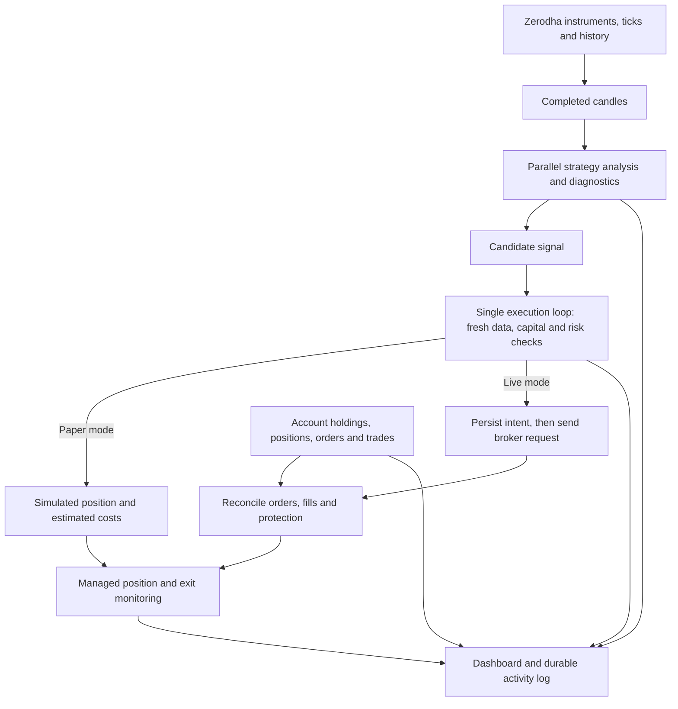

# Trading logic and analytics

This guide describes the rules implemented in StockPilot, including the conditions that prevent a trade. It is a guide to the current source code, not evidence that the strategies make money. The program uses deterministic price and volume rules; it does not learn from trades or predict prices with an AI model.

This guide covers strategy version **3.0.0**. For installation, environment variables, Cloudflare Tunnel and Zerodha configuration, see the [README](../README.md). The [strategy reference](STRATEGIES.md) specifies all 11 setup families, their thresholds, direction rules and scores; the [candle catalogue](CANDLE_PATTERNS.md) defines the 42 recognized formations.

## 1. What happens after Start Trading

1. The server connects to the configured Zerodha account after official authentication. It reads account balances, holdings, positions, orders and executed trades.
2. It downloads the NSE instrument list, opens market-data streams and starts historical candle downloads. Account monitoring begins even when new entries are paused.
3. Start Trading checks configuration, allocations, unresolved orders and the daily loss limit before enabling new entries. Successful login from a Start Trading request also requests this start operation.
4. Completed candles go to CPU workers. Each worker applies the configured deterministic strategy families, indicators and contextual candle patterns.
5. A qualifying signal becomes a **candidate**, not an order. Candidates are collected briefly and ranked. The single execution loop checks current prices, cash, breadth, account exposure, correlation, risk, liquidity, ownership and other restrictions.
6. An accepted candidate produces either a simulated paper fill or a real broker order. Real positions are derived from confirmed broker fills, not from the original order request.
7. Monitoring, exits, account reconciliation and audit recording continue while the server runs.
8. Automatic historical research separately collects a bounded sample and compares baseline and enhanced rules. Bounded parameter tuning can apply four validated numeric thresholds in the existing paper or live mode. It never enables live trading, changes permissions or starts orders.

The dashboard returns promptly after the Zerodha callback and exposes setup as a background operation. Its progress is a count of completed connection/start checks, with the current account download or verification step shown alongside it. It does not estimate elapsed time or wait for every subscribed stock to finish historical warmup. Saved-session restoration also reports progress and restores monitoring with entries paused. Pause cancels a pending request to enable trading; an already running broker request is allowed to finish before that setup operation settles.

Completed setup and trading readiness are separate states. A successful connection can still be waiting for market hours, clock verification, fresh quotes, usable completed history, funds or recovery of managed exposure. Those conditions remain visible in Entry readiness and the Background page. Finishing a progress bar never overrides an execution gate.



The browser and Cloudflare Tunnel provide access to the Node.js server. They do not perform the analysis. Closing the browser, signing out, or losing the tunnel connection does not pause the engine. Stopping the server stops local analysis and exit monitoring. All trading times use India Standard Time regardless of whether the server runs on Windows, macOS or Linux.

Sources: [trading.js](../src/trading.js), [main.js](../src/main.js), [broker.js](../src/broker.js).

## 2. Defaults and scope

| Control | Default | Meaning |
|---|---|---|
| Execution | Paper | Real Zerodha data; simulated strategy trades. |
| Paper capital | Derived from broker cash | The initial virtual budget is persisted; reconnecting does not refill the simulation. |
| Live capital | Derived from broker cash; execution disabled | Live mode and real execution must both be enabled in Settings. |
| Intraday | Enabled; allocation 100% | Initially receives all of the bot's capital allocation. |
| Swing | Disabled; allocation 0% | Overnight buying must be enabled and assigned a positive percentage in Settings. |
| Existing holdings | Selected symbols; selection empty | Holdings are observed; none is initially authorized for automatic selling. |
| Risk per new trade | 0.25% | Fraction of that strategy's allocated capital, including a sizing cost allowance. |
| Maximum new position value | 10% | Fraction of that strategy's allocated capital, including a sizing cost allowance. |
| Maximum positions | 5 | Bot positions and pending intraday entries count; adopted pre-existing holdings are separate. |
| Daily loss threshold | 1% | Fraction of the bot's current capital baseline, based on its estimated daily P&L. |
| Maximum bid/ask spread | 0.3% | `(ask - bid) / ask`. |
| Minimum turnover estimate | Rs 10,000,000 (1 crore) | Today's traded volume multiplied by latest price. |
| Intraday entry cutoff | 14:45 IST | No new intraday long or short entries at or after this time. |
| Intraday exit time | 15:10 IST | Begin requesting exits; this is not a guaranteed completion time. |
| Swing entry cutoff | 15:15 IST | Fixed in the current code. |
| Enhanced strategy selection | Enabled | All 11 intraday families; the original three also support long swing entries. Minimum heuristic score 60/100. |
| Intraday shorts | Enabled | Enhanced rules can open a short and later buy it back. Swing remains long only. |
| Higher-timeframe alignment | Enabled | Completed 15-minute EMA3/EMA9 confirmation for trend families; reversal families have separate gates. |
| Candidate collection window | 1,500 ms | Allows nearby analysis results to be ranked before execution checks. |
| Market breadth | Enabled | At least 30 liquid stocks, 20% fresh universe coverage and 45% advancing shares for longs or declining shares for shorts. |
| Account exposure limits | Enabled | Stock 25%, gross 90%, estimated stress loss 3% of reference assets. |
| Correlation check | Enabled | Absolute daily-return correlation threshold 0.85; correlated exposure limit 35%. |
| Announced-event filter | Enabled | Blocks entries one calendar day before through one day after a reported event; unavailable coverage also blocks. |
| Runtime entry checks | Enabled | At least 512 MiB free journal disk, 256 MiB available system RAM, and event-loop delay at most 2,000 ms. |
| Entry activity | 10 symbols/day | Counts new symbols attempted, not only profitable or filled trades. |
| Loss cooldown | 3 loss events; 30 minutes | Consecutive negative realized-P&L changes pause new entries; exits continue. |
| Automatic research | Enabled | 20-symbol sample and 45 calendar days; see section 12 for the actual scope. |

Only `KITE_API_KEY`, `KITE_API_SECRET` and `KITE_USER_ID` belong in `.env`. Other controls have defaults and are managed through the dashboard. Risk inputs labeled fraction use `0.0025` for 0.25%; strategy allocation inputs use percentage points, so `100` means 100%. Intraday and swing percentages together cannot exceed 100%. A positive allocation is required for each enabled buying strategy; swing never enables itself because cash increased.

Cash-derived capital and these percentages determine the rupee budgets used by the formulas below. Strategy and existing-holding settings apply without a restart, after entries are paused and managed exposure/pending orders are resolved. Application settings such as mode, risk, worker capacity, port and data directory require the same exposure checks followed by a server restart. Administrator password/key changes revoke dashboard sessions without changing trading permission.

### Where capital comes from

The engine reads verified broker cash information after authentication. It does not treat the market value of existing holdings, collateral, or available leverage as cash to deploy. Before any live entry, current available cash is checked again independently of the strategy budget.

Using `margins.equity.available`, the conservative cash calculation is:

```text
cash = available.cash
balance = available.live_balance, falling back to margins.equity.net
spendable_cash = max(0, min(cash, balance - collateral - adhoc_margin))
```

Missing collateral/adhoc margin default to zero. Cash and balance must be finite numeric values; blanks, booleans, missing values and negative collateral/adhoc margin are invalid. Invalid data makes deployable cash zero and retains any established capital baseline rather than treating a malformed response as a withdrawal. The UI shows zero trading capital before verified funding information is available.

Before paper capital has been seeded, and for live entries, zero available cash blocks new long and short entries but does not reject an otherwise valid Start request. The engine remains armed with a **Waiting for funds** indicator, automatically observes later verified balances, and continues exit management for authorized eligible existing holdings or already managed exposure. No second Start is needed when the first funds arrive. Deposits never re-arm an engine that was manually paused, halted by risk controls, or restarted. Start still verifies the current account; stale prices or unresolved orders still block decisions. The daily-loss comparison is applied only when the bot has a positive capital baseline.

Paper mode initializes its virtual starting capital from available account cash once and saves that baseline with its simulated positions and P&L. Subsequent login, browser refresh and server restart do not reset paper losses, refill simulated cash or replace the initial balance with the current real account balance.

Live mode establishes its allocation baseline from available cash when starting/reconnecting without owned exposure or unresolved orders. While armed and flat, subsequent verified cash updates reconcile deposits and withdrawals automatically: `baseline = available_cash - (realised - capital_accounted_pnl)`. If withdrawals exhaust that baseline, the remaining cash becomes the new baseline and current realised P&L is marked already accounted in equity. This keeps the first refresh equal to actual cash, including a withdrawal of profits; total realised P&L, daily P&L and cooldown history remain intact. A daily loss already at the existing limit halts entries before a deposit can enlarge that limit. While exposure or pending intents remain, recovery retains the established budget rather than adding share notional to reported free cash; a leveraged cover order could otherwise overstate deployable funds. Zero available cash prevents new entries but does not disable monitoring of existing exposure.

When an older live journal has exposure but no recorded capital baseline, recovery takes the greater of verified cash and the bot's recorded notional exposure as the initial risk baseline; it never adds them together. Every new entry still passes the independent cash limit. Older paper journals without a stored baseline initialize from current cash while retaining their positions and recorded P&L. Legacy rupee allocations are converted to proportions of their combined amount, so review Settings before resuming; the old manually configured capital is not carried forward as a funding source.

Source: capital refresh and strategy allocation logic in [trading.js](../src/trading.js).

The entry universe intersects Kite's `exchange=NSE`, `segment=NSE`, `instrument_type=EQ` instruments with NSE's current [equity and ETF security lists](https://www.nseindia.com/static/market-data/securities-available-for-trading). Equity records must have exchange series `EQ`; ETFs must match the separate ETF directory exactly. Kite's instrument type `EQ` is broader than exchange series EQ and includes debt instruments, so it cannot establish stock eligibility by itself. BE/BZ stocks and unrelated instruments are not admitted as new entries. Enhanced intraday rules support both long positions (BUY entry, SELL exit) and short positions (SELL entry, BUY exit), subject to broker cover-order eligibility. Swing and existing-holding management remain long only. The optional baseline remains long only. There are no derivatives or overnight short strategies.

All verified matching instruments are subscribed, up to the implemented limit of 9,000 across three streams of at most 3,000. The list is never silently truncated. Already-managed NSE instruments outside the verified entry universe are retained for exits and recovery, excluded from fresh entries, market breadth and research samples. A genuinely oversized verified-plus-managed list blocks setup. Subscription does not imply eligibility to trade: warmup, turnover, spread, broker permissions and the other gates still apply.

Both directory downloads have bounded size and time limits, strict schema/identity checks and completeness floors of 1,000 equity records and 50 ETFs. Valid directories are cached only for the same IST calendar day; failed or incomplete responses are not cached as successful. When classification is unavailable, the engine retains managed instruments and account monitoring while blocking new entries. It retries on a later monitoring pass, no more often than once a minute, and refreshes the broker master and directories after a day change. Existing broker consent requirements survive an unavailable directory. The activity log and operational readiness show the classification outcome and coverage.

Daily and prior-session candle caches are bound to the symbol associated with an instrument token. A reused token cannot import another security's cached history; legacy caches without a known identity are downloaded again. Universe changes invalidate outstanding data work and retired feed callbacks. Stream replacement is not marked complete until setup succeeds, so a failed replacement remains eligible for the bounded monitoring retry.

Sources: [config.js](../src/config.js), `TradingEngine.connect`, `strategy_settings`, `_enter_locked` in [trading.js](../src/trading.js).

## 3. Market data and candle construction

### Time and freshness

Trading decisions use India Standard Time. The regular-session check is Monday to Friday, 09:15 inclusive to 15:30 exclusive. There is no authoritative exchange holiday or special-session calendar in the program. Fresh exchange data is required in addition to the clock check.

- Stream ticks need a valid positive last price, valid nonnegative volume and an exchange timestamp within 10 seconds of the server clock. Older per-instrument timestamps are rejected before quotes, depth, marks or candles can change; equal timestamps remain valid for multiple updates in one second.
- Transport delay consumes the same ten-second quote lifetime. The internal monotonic `received_at` field is a conservative freshness origin, computed as receipt time minus observed nonnegative exchange age. A nine-second-old packet therefore has at most one second left, rather than receiving another ten seconds. Slightly future timestamps never extend that lifetime. Breadth, quotes, entry/exit checks and feed readiness use the same origin.
- New entries also require an account snapshot at most 45 seconds old and a recent aligned broker/system clock observation. Ordinary Kite HTTPS responses supply their Date header; uncertainty bounds include request latency and one-second header precision. Missing, stale or uncertain clock evidence blocks new entries. Confirmed skew also rejects ticks and clears earlier executable quotes, because actually old exchange prices can otherwise appear current on a slow host.
- Account reconciliation runs approximately every 15 seconds, plus wakeups from order notifications. REST work can lengthen this interval.
- Delivery operations perform additional broker quote checks, normally allowing up to 30 seconds of quote age; stream hints require both exchange and receive timestamps within 10 seconds.
- CPU results are discarded if they belong to an older connection/day generation, a superseded candle or analysis request, or were queued more than 30 seconds ago. Replacing a request or accepting a newer no-signal result removes its old candidate. Execution rechecks the source request and latest completed candle; an intraday source expires at the next five-minute boundary even if a replacement tick has not arrived.

WebSocket order updates and validated postback notifications prompt reconciliation. A notification alone is never accepted as proof of a fill; the engine verifies broker order/account state.

Clock observations add no network requests and never correct operating-system time or rewrite exchange timestamps. A known skew remains blocked through malformed/missing headers and ambiguous observations until a fresh aligned observation clears it. A host-clock jump also requires a fresh observation. The dashboard and activity log expose the condition; account reconciliation and broker-held protection remain separate. Clearing the clock condition does not re-arm a manually paused engine.

### Five-minute candles

Each instrument has a book of up to 80 completed five-minute candles, plus one forming candle. Prices form open/high/low/close; volume is derived from changes in the day's cumulative traded volume.

The first candle observed after subscribing is treated as partial. For live-observed candles, the builder requires consecutive buckets, a tick near the start of the candle and an observation within the last 30 seconds before its close. It clears the completed sequence when that continuity test fails. Out-of-order ticks and same-day cumulative-volume rollbacks are ignored before updating quotes, marks, freshness or candle state. Retaining the volume baseline prevents the next normal tick from counting the same trades twice. Equal-time updates with unchanged or increasing volume remain valid; zero-volume updates do not change an already forming candle's OHLC. A new trading date clears the live candle sequence and permits the cumulative volume to reset.

Historical warmup prioritizes managed positions and then current turnover. It loads completed current-session bars and, for enhanced analysis, a separate prior-session seed. The loader searches the preceding seven calendar days, accepts a valid prior series with at least 34 bars ending at 15:25, and caches it for today's connection. Strategy validation checks each supplied session for increasing, uninterrupted five-minute timestamps. Neither the forming candle nor a fabricated missing interval is used.

Cached and in-memory prior seeds must pass the same loader checks as new history: at least 34 valid consecutive candles from one earlier session, no more than seven calendar days old, ending at 15:25. A malformed, stale, current-day, future or incomplete seed is not reused to mark warmup complete; invalid in-memory completion state is cleared and the prior history range is requested again. A valid seed keeps the normal current-session-only download path.

Recursive indicators use up to 150 prior bars followed by today's completed bars. They need at least 34 combined bars; they no longer require 34 bars from today. Session VWAP always resets at today's 09:15 candle and requires complete current-session coverage. The prior session's final close supplies gap comparisons. Completed 15-minute bars provide separate trend alignment; partial 15-minute buckets do not count. See the [causal-context and warmup rules](STRATEGIES.md#causal-context-and-warmup).

With a usable seed and all other gates satisfied, the three-candle opening drive can be evaluated at 09:30 and the default 15-minute opening-range breakout at 09:35. Some reversal setups need only two current bars. These are earliest possible decision times, not promises of a trade. Without a prior seed, the 34-bar indicator requirement can delay enhanced entries until about 12:05; the optional baseline independently needs 21 current bars, about 11:00. A late start, gaps, missing benchmark data and rate-limited downloads can delay individual families further.

Historical seeding, Start/Resume and completion of recovery can queue analysis of the latest usable completed candle without waiting another full interval. That intraday candle must belong to today, be complete, and have closed less than five minutes ago. Normal candle closes queue subsequent analysis. Execution still requires fresh current quotes and completed account recovery.

Benchmark and sector candles can arrive after a stock's closing tick. After market-context refresh, changed reference history requeues the still-current stock candle for symbols with fresh quotes. Identical context is deduplicated; an older worker result cannot replace the newer contextual decision.

### Daily candles

Daily history requests cover approximately 160 calendar days, ending before today's session. Today's unfinished daily candle is excluded. Completed history is validated before it is accepted or cached for the current date: finite OHLCV, valid price geometry, increasing dates, required minimum length, freshness, no daily gap longer than seven days and no open-to-prior-close discontinuity above 20%.

- With swing disabled, history is loaded for existing NSE holdings and managed swing/delivery positions.
- With swing enabled, history is loaded for the whole subscribed universe; holdings and managed delivery exposure are prioritized first, then current turnover.
- The correlation filter also requests daily history for relevant account exposure and candidate pairs, even when swing buying is disabled.
- The main history loader requires at least 21 daily bars for holdings/managed delivery analysis and 55 for other swing candidates. The latest bar must be no more than seven calendar days old.
- A holdings series with 21–54 bars can support exit analysis but cannot qualify for a new swing breakout, which always requires 55 bars.
- Large daily discontinuities invalidate the relevant calculations rather than being interpreted as ordinary trend changes. This is a guard, not full corporate-action adjustment.

Daily analysis is normally queued on the first fresh tick for an instrument after its daily history is ready. Start/Resume also queues available history for instruments with fresh quotes. Reconnect clears old in-memory series and queued decisions before rebuilding current coverage; the date-keyed historical cache can still supply valid daily bars.

An empty, stale, malformed or insufficient daily response does not mark coverage complete or become an accepted cache entry. An unusable cache left by an older run is bypassed for a fresh request. Each failed symbol backs off independently for 60, 120, 240 and then at most 300 seconds between attempts; other symbols continue loading, with managed holdings prioritized. Valid history is reused while failed symbols wait. The ordinary 30-second history loop and broker queue can make an actual retry later than its minimum delay. Restart/reconnect and a new trading date reset the transient retry timer and revalidate available cache; they cannot make unusable history eligible. Coverage is complete only after every requested symbol has usable history.

Historical downloads share the serialized REST adapter with account and order calls: calls start at least 0.36 seconds apart, and quote calls at least 1.05 seconds apart. A cold full-universe download therefore takes substantial time even on a large machine. Scanner coverage grows progressively; CPU capacity does not bypass broker rate limits.

Sources: `CandleBook` in [strategy.js](../src/strategy.js); `_on_ticks`, `_history`, `_intraday_history`, `_seed_intraday` in [trading.js](../src/trading.js).

## 4. Baseline and enhanced entry rules

Here `O`, `H`, `L`, `C`, and `V` mean candle open, high, low, close and volume. `SMA(n)` is the arithmetic mean of the latest `n` closes. All windows below include the last completed candle unless explicitly described as previous candles.

The original breakout rules below are the **baseline** used in research and when enhanced selection is disabled in Settings. Enhanced selection is enabled by default and adds the families and checks described after the baseline formulas.

### Baseline ATR used by both strategies

For each candle after the first:

```text
true_range = max(H - L, abs(H - previous_close), abs(L - previous_close))
ATR14 = arithmetic mean of the latest 14 true ranges
```

This is a simple average, not Wilder's smoothed ATR. It requires at least 15 bars; otherwise the helper returns zero.

### Intraday breakout

The latest 21 completed five-minute candles must pass **every** condition:

1. All 21 are consecutive five-minute bars.
2. Latest close is strictly above the highest high of the preceding 20 bars.
3. Latest volume is at least 1.5 times the average volume of those preceding 20 bars; that average must be positive.
4. `SMA(5) > SMA(20)`.
5. Latest range `H - L` is positive, `(C - O) / (H - L) >= 0.60`, and `(H - C) / (H - L) <= 0.20`. This requires a strong bullish body and a close near the high.
6. Define `R = max(1.5 × ATR14, 0.004 × C)`. Reject if `R / C > 0.025`.

A passing signal has reference price `C`, stop `C - R`, target `C + 2R`, and score `min(10, V / average_previous_volume)`.

### Swing breakout

The strategy takes the latest 55 completed daily bars and requires:

1. No consecutive pair in those 55 bars has `abs(next_open / previous_close - 1) > 0.20`.
2. Latest close is strictly above the highest high of the preceding 20 daily bars.
3. `SMA(20) > SMA(50)`.
4. Latest volume is at least 1.5 times the preceding 20-bar average, which must be positive.
5. Latest candle has positive range, `C > O`, and `(H - C) / (H - L) <= 0.25`.
6. Define `R = max(2 × ATR14, 0.02 × C)`. Reject if `R / C > 0.08`.

A passing signal has reference price `C`, stop `C - R`, target `C + 2.5R`, and the same relative-volume score capped at 10.

The baseline score is relative volume capped at 10, not a probability or a tested performance estimate. Enhanced signals use a separate 0–100 heuristic score. Within a configured run the engine sorts candidates by descending score, with symbol and strategy as deterministic tie breakers, after the configured collection window. This ranking does not establish future performance.

Stops and targets above are generated from the completed candle's close. Actual order pricing and tick rounding can change the distance from the executed entry, so the final realized reward/risk ratio need not equal 2 or 2.5.

Source: `atr`, `intraday_signal`, `swing_signal` in [strategy.js](../src/strategy.js).

### Default enhanced selection

Enhanced mode validates finite positive OHLC, nonnegative volume, strictly increasing timestamps and required continuity before computing indicators. Intraday uses prior-session seeds for recursive indicators while keeping today's VWAP separate. Swing needs at least 55 completed daily bars, no duplicate dates, no gaps longer than seven calendar days, and no open-to-previous-close discontinuity greater than 20%. Unavailable required indicators prevent an entry.

| Family | Required evidence |
|---|---|
| Breakout | All baseline breakout conditions; EMA9 above EMA21 with close above EMA21; ADX14 at least 18 and +DI above −DI; positive MACD histogram; Wilder RSI between 45 and 78; price extension above EMA21 no more than 2.5 Wilder ATR. Intraday close must be at/above full-session VWAP. |
| Trend pullback | The same EMA/ADX/directional/extension/VWAP trend checks. Current or previous low touches its EMA9, current close reclaims EMA9 with signed bullish body at least 40% of range. MACD is positive and its histogram improves; RSI is 45–70 by default; relative volume is at least 1. A bullish pattern of heuristic strength at least 60 or a close above the prior high must confirm the move. |
| Range reversion | ADX below 18; prior close touched its lower Bollinger band or current low touches the current lower band. Current bullish close re-enters above the lower band and stays below the middle band. Prior RSI is at most 40, current RSI improves and remains below 55. A bullish pattern of strength at least 60 or a close above the prior high must confirm. Reward to the middle band must be at least 1.2 times initial price risk. |

These are the original three enhanced families and describe long geometry. Breakout and pullback now also require enabled completed 15-minute alignment for intraday. All three can be mirrored for intraday shorts; swing stays long only. Reversion has its own RSI/reward conditions rather than the trend RSI band. The global directional market-breadth and portfolio gates still apply to every family, including reversion.

Version 3 adds **opening range, opening drive, gap continuation, gap reversal, VWAP reclaim, VWAP rejection, volatility squeeze and benchmark relative strength**. These eight intraday families have distinct structure, time, volume and context requirements. Most use directional EMA/DI/MACD/RSI/VWAP and 15-minute alignment; gap reversal uses recovery conditions instead. Unlike breakout/pullback, these newer trend setups have no hard minimum ADX, although ADX contributes to their score. Their exact conditions, minimum current bars and stops are in the [strategy reference](STRATEGIES.md#setup-coverage-and-entry-conditions).

Breakout and pullback use `R = max(Wilder ATR14 × 1.5, close × 0.004)` intraday, or `max(Wilder ATR14 × 2, close × 0.02)` for swing. Their targets are `close + 2R` and `close + 2.5R`. Reversion uses `R = max(close - min(current low, prior low) + 0.25 × Wilder ATR14, close × 0.004)` intraday, or the same formula with a 1% price floor for swing; its target is the current Bollinger middle band. All families reject risk above 2.5% of price intraday or 8% swing.

An opposing pattern with strength at least 80 and at least as strong as the strongest supporting pattern blocks that setup: bearish opposition for longs, bullish opposition for shorts. Pattern strengths are fixed geometry/context weights, not probabilities. Overlapping pattern names do not add repeated votes: only the greatest supporting and opposing strengths enter the confirmation logic.

Each passing family/side receives a weighted score; the highest passing combination becomes the candidate. Contributions for the original three families are bounded by their weights:

| Component | Breakout | Pullback | Reversion |
|---|---:|---:|---:|
| Trend / range strength | 20 | 20 | 20 |
| Directional separation | 10 | 10 | — |
| Momentum / RSI recovery | 15 | 15 | 20 |
| Relative volume | 20 | 15 | 15 |
| Candle geometry | 15 | 15 | 20 |
| Distance from EMA / reward | 10 | 15 | 15 |
| Strongest bullish pattern | 10 | 10 | 10 |

The total is clamped to 0–100 and rounded to one decimal place; the default minimum is 60. The newer eight families use weights of 20 trend, 10 directional separation, 15 momentum, 20 volume, 15 candle, 10 required structure and 10 pattern. See [all scoring formulas](STRATEGIES.md#heuristic-score). The dashboard shows supporting and opposing evidence for actual candidates. These weights are explicit research choices; they have not been fitted to demonstrated live returns.

## 5. Additional CPU analytics: what affects a trade

Workers calculate indicators and diagnostic metrics from completed candles. Enhanced selection uses EMA, RSI, MACD, ADX, directional movement, Wilder ATR, Bollinger Bands, VWAP, relative volume and candle patterns as described in section 4. Regression slope, R², return volatility and efficiency ratio remain explanatory diagnostics, not additional entry gates.

| Indicator | Calculation and warmup |
|---|---|
| EMA9 / EMA21 | Seed with the first period's arithmetic mean, then apply `EMA += 2/(period+1) × (close - EMA)`. |
| Wilder RSI14 | Seed gains/losses with the first 14 changes, then Wilder smoothing `(previous × 13 + current)/14`. Flat series is 50; all gains is 100. Fewer than 15 closes yields unavailable. |
| MACD 12/26/9 | Independently seeded EMA12 minus EMA26; signal is EMA9 of available MACD values; histogram is MACD minus signal. Requires 34 bars for the first histogram. |
| Wilder ATR14, +DI14, −DI14, ADX14 | Smooth true range and directional moves over 14 periods. ADX seeds from the first 14 directional-index values, then applies Wilder smoothing. This is distinct from baseline simple-average ATR. |
| Bollinger Bands20 | Mean of 20 closes ± two population standard deviations. Width is `(upper-lower)/middle`, a fraction. |
| Session VWAP | Sum of `((high+low+close)/3) × volume` divided by volume from the 09:15 candle. Gaps or a late start make session VWAP unavailable; a partial window value is labeled separately and cannot satisfy the intraday entry gate. This is candle-based VWAP, not a tick-perfect exchange measure. |
| Relative volume20 | Latest volume divided by the mean of the preceding 20 volumes. Zero/missing comparison volume is unavailable. |
| Prior-session volume comparison | Matching clock-time volume ratio for the newer families; opening drive also compares the first three candles. Falls back to relative volume20 when unavailable. |
| ATR extension | `(close - EMA21) / Wilder ATR14`; entry checks orient the sign to the trade side. |
| 15-minute context | Exact complete three-candle buckets anchored at 09:15, with EMA3/EMA9; at least nine complete buckets and a recent latest bucket. |
| Relative strength | Stock session-open return minus benchmark return at exactly matched completed timestamps; optional sector excess is reported separately. Fractions, not percentage points. |
| Squeeze context | Previous Bollinger width and the lower quartile of the previous configured width observations, excluding the current width. |

Unavailable values remain `null` and display as a dash; they are not replaced by a neutral or zero signal. [indicators.js](../src/indicators.js) contains the recurrences. The [42-pattern catalogue](CANDLE_PATTERNS.md) describes every recognized formation and its contextual limits.

| Diagnostic | Calculation and interpretation |
|---|---|
| `rsi14` | The Wilder-smoothed RSI described above; used in enhanced setup gates. |
| `atr14` | The simple-average ATR described above. |
| `return_volatility` | Population standard deviation of simple close-to-close returns `next_close / prior_close - 1`. A fraction per candle, not annualized volatility. |
| `trend_slope_pct` | Ordinary least-squares slope of closes against bar index, divided by last close and multiplied by 100. Percent of last price per bar. |
| `trend_r_squared` | Squared correlation of bar index with closes, measuring fit to a straight line; zero for a degenerate/flat series. It is not a forecast accuracy estimate. |
| `efficiency_ratio` | `abs(last_close - first_close) / sum(abs(each_close_change))`; zero if the path does not move. |
| `candle_body_ratio` | `abs(C - O) / (H - L)` for the last bar, with a tiny denominator floor. This diagnostic is unsigned; entry rules use the directional body. |
| `upper_wick_ratio` | `(H - max(O, C)) / (H - L)` for the last bar, with the same floor. |

Regression, volatility and efficiency diagnostics use the supplied current series: up to 80 intraday bars or the available daily history. Enhanced intraday recursive indicators, simple ATR diagnostics and trailing indicator windows can additionally use up to 150 prior-session seed bars. Current-session VWAP, opening structures and relative-strength return anchors exclude yesterday. Baseline breakout rules use their 21/55-bar slices, so the calculation windows are not identical.

Automatic worker capacity is `max(1, detected_available_CPUs - analytics_reserve_cpus)`, with a default reserve of four. A positive analytics-worker value in Settings sets a ceiling capped at detected logical CPUs. The capacity detector prefers the runtime's usable parallelism. On supported newer Windows versions, a bounded read-only CIM probe can establish a machine-wide processor-group estimate when no reduced primary-group affinity is detected; otherwise the runtime limit remains. The dashboard exposes the estimate and its scope. This does not change affinity or guarantee utilization across all CPUs, CPU sets or job restrictions. See [capacity.js](../src/capacity.js).

Analytics uses Node.js `worker_threads` on all supported platforms. Workers are created only when concurrent batches need them and retire after 60 seconds idle. Each normally analyzes 32 instrument/strategy records; batch size is limited to 1–256. The worker's V8 heap budget is 64 MB old generation plus 16 MB young generation, with a 4 MB stack; total process memory also includes worker/runtime overhead. This is a calculation-capacity ceiling, not a request to occupy every core permanently.

A newer pending bar replaces an older queued bar for the same instrument and strategy. The dispatcher limits concurrent batches to the worker ceiling; the pool also bounds its accepted backlog. Each dispatched batch has a **15-second deadline**. A timeout rejects that batch and terminates its worker; queued work can use a replacement. The deadline starts on dispatch, not while waiting in the queue, and normal completion clears it. Analytics workers receive candles and bounded strategy context, not broker credentials or database connections. Results preserve the input candle time and generation so the execution service can reject stale results.

Market-data sockets use up to three separate feed workers, each with at most 3,000 instruments. They are separate from the analytics pool. The installed official KiteTicker SDK shares socket state within a JavaScript module, so putting each connection in its own isolate keeps its subscription and reconnection state independent. REST requests remain in the coordinated broker adapter and are not multiplied by the CPU worker count.

The SDK retries ordinary connection failures inside its worker. If that worker exits, fails, or exhausts the SDK reconnect budget, the adapter retires it and restores the same subscription after increasing delays of 1, 2, 4, 8, 16, 32 and at most 60 seconds. A connection stable for at least 60 seconds resets this backoff. Old callbacks and pending restart timers cannot create feeds after shutdown or a newer stream request. An unconfirmed worker termination remains tracked and blocks replacements until it is resolved, preserving the three-connection ceiling. These retries apply to market-data connections, never order mutations. Fresh prices, completed history and account recovery still gate new entries after reconnection.

Low CPU usage while waiting for ticks or REST history is expected. The system does not create artificial load. **Only one application execution process sends orders**, regardless of analytics worker count.

Machine-health measurements refresh on a two-second monotonic interval. Correcting the system clock in either direction cannot freeze old memory/disk readings or bypass that sampling interval.

Source: [analytics.js](../src/analytics.js), `_analysis_loop` and `_analysis_finished` in [trading.js](../src/trading.js).

### Live background-work visibility

The **Background** page uses the same authenticated live dashboard updates as the account view, including polling through Quick Tunnels. It shows task status and the current download item when available, candle coverage, retry information, analytics queue/worker capacity and active batches, and a summary of historical research. Short batches can finish between updates, so an empty active-batch list means no batch was observed at that snapshot; cumulative worker counters and Activity provide additional context.

Daily-history totals refer to the symbols currently needed by swing, existing holdings and correlation checks. Intraday coverage refers to usable session history. Valid cached candles can satisfy coverage without a new download; a failed or deferred request does not count as ready data. A closed market, absent fresh prices or a retry delay is shown as waiting, rather than as a fictitious download. Daily analytics can run for holdings and account risk even when new swing entries are disabled.

Worker completion counts measure computation, not approved trades. A completed result can be rejected for stale candles, an old connection/universe generation, changed context or a newer analysis request. Entries still pass the normal candidate and execution checks. Pause leaves connected account monitoring, analysis and managed-position exits running. Progress snapshots are operational views; they do not replace the durable event log or the separate Research report.

## 6. From candidate to quantity and order

A candidate can be rejected even when its chart pattern is valid. The execution gates check:

- Trading is enabled, the strategy has a valid positive allocation, the session is open, and its entry cutoff has not passed.
- No maintenance lock, unresolved order/protection problem, daily loss breach or machine-capacity blocker prevents entries.
- Account and instrument quotes are fresh; a symbol is not already a bot position, an outstanding intent, or traded by the bot today.
- Bot position capacity is available. In live mode, an existing account position, holding, or nonterminal order for the same symbol also prevents a new long or short entry.
- Best bid and ask exist and are positive; ask is not below bid; spread is at most the configured limit.
- `today_volume × last_price` meets the turnover threshold. This is an estimate, not the actual sum of all traded prices times quantities.
- Current executable-side quote (ask for BUY, bid for SELL) is within 0.5% of the intraday signal reference or 2% of the swing reference, in either direction.
- Enough capital, risk budget, cash and visible quantity at the applicable top-of-book price are available.
- The configured live breadth sample is ready and supports the trade direction; daily activity and loss-cooldown limits permit new risk.
- Announced-event coverage is verified and fresh, with no event inside the configured blackout window while that filter is enabled.
- A new swing position passes the shared daily-management gate: valid completed history, no current daily trend exit, and executable entry above the current daily trail. A setup that the daily policy would immediately liquidate is rejected before buying, in both baseline and enhanced modes.
- Existing account exposure, proposed position concentration, estimated stress loss and historical correlated exposure pass their configured limits.

### Ranking and account-wide entry controls

Candidates wait for the configured 1,500 ms collection window, then sort by score descending with symbol and strategy tie breakers. The execution loop considers at most ten per cycle. This compares available nearby results; it is not a globally synchronized ranking of every NSE stock. The queue holds at most 200 candidates, replaces older candidates for the same stock/strategy and retains the existing 30-second freshness limit. Ranking never skips a failed execution gate.

An immediate cover-order rejection releases its reservation only when the adapter verifies a well-formed, recognized precondition error without an order or trigger acknowledgement. Timeouts, HTTP 5xx responses, malformed envelopes and contradictory acknowledgements remain unknown even if they contain an `InputException` label. Their journal ownership and cash reservation remain until broker reconciliation resolves the outcome; the mutation is never automatically resubmitted.

**Market breadth** uses the subscribed universe's quotes received within ten seconds. Fresh coverage is fresh quotes divided by subscribed instruments; the breadth sample further requires positive open/last prices and the configured turnover estimate. Advancing means latest price is above today's open, not yesterday's close. The denominator is advancing + declining + unchanged eligible shares. By default at least 30 liquid stocks and 20% fresh universe coverage are required. Long entries need at least 45% advancing; shorts need at least 45% declining. Missing coverage or insufficient directional breadth blocks new entries; it does not disable exits. The two thresholds are independent and can both pass in a mixed market.

**Market context and announced events** come from read-only NSE/NSE Indices sources and broker index data. The app loads NIFTY 500/50 and selected sector constituents (Bank, IT, Pharma, Auto, FMCG and Metal), board-meeting and event-calendar announcements, and available benchmark candles. It validates schemas and labels freshness/coverage; it does not infer missing industry membership from a symbol name. The default limits are seven days for classifications, 60 minutes for event-source observations and 120 seconds for benchmark quotes. Current verified membership can select sector context for strategy/research joins.

The event entry gate blocks both directions from one calendar day before through one calendar day after a reported event by default. Missing, stale, incomplete or unverified symbol coverage also blocks while enabled. It covers announced board meetings and financial-result events, not every news story, corporate action, holiday, special trading session or surprise announcement. “No announced event” means none found in the fresh queried feeds. Public website endpoints can fail or change and have no application availability guarantee. Such a failure can reduce trading eligibility; it does not make local exits depend on calendar availability.

**Runtime checks** prevent new entries when available journal-disk space is below 512 MiB, available system memory below 256 MiB, or measured event-loop delay exceeds 2,000 ms by default. Unavailable/nonfinite measurements also block. Readiness reports these operational prerequisites separately from individual candidate gates. These checks reduce the chance of adding risk under resource pressure; they cannot ensure an exit is processed during a machine failure.

**Account exposure** includes existing/manual holdings, T1 shares, account positions, owned bot positions and unresolved pending bot or manual orders. Unowned pending orders reserve full remaining notional even when they may have been intended as exits. Pending cancellation or modification does not release unfilled exposure before terminal broker confirmation. Recognized journal-owned entries and quantity-verified protective exits are matched conservatively to avoid double counting. A pending short requires an observed price because its sell limit is only a minimum sale price. Unpriced or malformed pending orders block additional entries while account risk controls are enabled.

Used quantities reduce holding exposure; pledged share value still counts as investment exposure even when unavailable for sale. A negative CNC day position offsets the matching holdings' used quantity before gross exposure is calculated: a sale already removed from available holdings is not counted again as a new short. Any unmatched negative position quantity still counts as exposure. Journal and broker exposure are combined conservatively to avoid straightforward double counting; paper exposure is additional simulated risk. Unpriced exposure, unsupported products or nonpositive reference assets block a new entry while this control is enabled.

Reference assets are an internal estimate, not a broker-certified NAV:

Holding exposure uses the larger of reported pledged quantity and settled plus T1 quantity less used shares, so a separately reported pledged balance cannot disappear. Current broker prices or fresh streamed prices verify valuations. An acquisition-cost fallback may be displayed, but it does not authorize a new entry when a current holding valuation is missing; a stale streamed quote cannot override a newer broker price.

```text
live_reference_assets = current_verified_cash + holding_value
                        + positive_live_CNC_position_value
paper_reference_assets = persisted_paper_capital + holding_value
```

The live account-wide limits use current verified cash, so a withdrawal reduces their reference assets even while the engine retains an older strategy capital baseline for its journal. That frozen baseline does not provide a floor for live account-wide risk limits. Before an entry, stock concentration including the proposed value must stay within 25% of reference assets, gross exposure within 90%, and estimated stress loss within 3% by default. Long and short notional both add to gross exposure. A verified bot stop contributes its directional planned price distance to stress loss; remaining exposure uses a default 5% adverse move. The proposed trade also includes a 0.2% cost allowance in its stress check. Stops, gaps and actual execution can exceed this scenario estimate.

**Correlation** aligns daily return pairs by both actual start and end dates, uses at least 20 overlapping return observations and at most the latest 60, and rejects observations with moves above 20% as discontinuities. It uses the **absolute value of Pearson correlation**: both +0.85 and −0.85 enter the correlated group at the default threshold. Existing grouped exposure, the proposed trade and same-stock exposure together must remain within 35% of reference assets. Long and short notional are added conservatively; the app does not assume that an opposite-side position provides a hedge. Missing/degenerate history blocks the entry and requests the necessary daily series. This is not a sector-factor optimizer.

**Activity and loss controls** permit at most ten newly attempted symbols per day by default. Three consecutive negative realized-P&L updates trigger a persisted 30-minute cooldown; a positive realized update resets that event count. Several fills reconciled together can be one event, so this is a count of realized loss events rather than an exact count of losing trades. Cooldown blocks new long and short entries while exits continue. It is separate from the daily P&L liquidation threshold and resets with the trading-date state.

The dashboard's Decision controls explains current breadth, estimated exposure, ranked candidates and global blockers. Candidate-specific rejections remain in Latest analysis and the activity log. Defaults and implementation: [config.js](../src/config.js), [decision-controls.js](../src/decision-controls.js), [trading.js](../src/trading.js).

### Position sizing

For a long, planned entry is `ask × 1.0005`, rounded **up** to the instrument's tick size, and stop is rounded **down**. For a short, entry is `bid × 0.9995`, rounded **down**, and stop is rounded **up**. Entry must remain strictly between stop and target in the trade direction: `stop < entry < target` for BUY and `target < entry < stop` for SELL. A target already passed by the executable quote cannot qualify. The 0.05% adjustment accommodates price movement, but a real limit order can still remain unfilled or partially fill.

Let `A` be strategy allocation, `F` remaining spendable budget, `E` rounded entry and `S` rounded stop. Position sizing is:

```text
per_share_risk = abs(E - S) + 0.002 × E
quantity = floor(min(
    A × risk_per_trade_pct / per_share_risk,
    A × max_position_pct / (E × 1.001),
    F / (E × 1.001)
))
```

Nonfinite values, invalid prices, nonpositive budget or quantity below one prevent the order. The extra 0.2% in per-share risk budgets estimated entry and exit costs; the 0.1% in entry notional budgets entry costs.

Remaining budget is limited by the strategy's unused percentage allocation and the current capital baseline, reduced for realized losses since that baseline and current/pending exposure. A live baseline refresh while flat can reflect changed account cash; an open position's profit does not silently enlarge its budget. Live cash is additionally bounded by reported cash and live balance after excluding collateral/adhoc margin and reserving bot notional exposure. Both longs and shorts reserve full entry notional even if the broker offers leverage. Short-sale proceeds do not become extra simulation capital or justify a second allocation.

Pending delivery reservations include only still-unresolved entry quantity. Once a partially filled IOC entry is confirmed terminal, its cancelled remainder no longer reserves cash or counts as pending account exposure. The confirmed shares continue to count until reconciled exits remove them. The engine's allocation calculation, account exposure checks and delivery manager use this same distinction; an ambiguous or still-open entry retains its unresolved reservation.

The best ask's displayed quantity for a BUY, or best bid's quantity for a SELL, must cover the entire request; depth across multiple levels is not aggregated for this check. Combined directional planned stop-distance risk for current bot positions, pending intraday entries and the proposed trade must not exceed `capital_baseline × daily_loss_pct`. This planned-distance calculation excludes fees and cannot cap actual losses during price gaps. Existing holdings are outside this bot-risk budget.

Sources: `position_size` in [strategy.js](../src/strategy.js); `_enter_locked`, `_exposure` in [trading.js](../src/trading.js).

## 7. How orders and exits work

Live recovery requires an explicit nonnegative whole-number fill count no greater than the requested order quantity, and a positive finite average execution price when any shares filled. A `COMPLETE` order must report its full quantity. Missing, contradictory or malformed fill data preserves ownership and unresolved reservations instead of being treated as a zero-fill cancellation. Invalid observations do not replace verified cached orders, close a position, change P&L, or authorize duplicate exits/protection. Previously cached malformed responses must be reverified; valid zero-fill rejections/cancellations and confirmed terminal partial fills remain supported. These checks use reconciled order data, not notification payloads. [Kite order attributes](https://kite.trade/docs/connect/v3/orders/#response-attributes), [Kite clarification on partial-fill prices](https://kite.trade/forum/discussion/5105/canceling-an-order-but-still-getting-a-filled-qty).

### Paper mode

Paper mode uses real market data and account reads but does not place broker orders. A passing long or short entry is filled immediately at the adjusted, rounded entry price. This is a simplified model: no order queue, broker rejection or partial-fill simulation is performed.

A bot position exits when a fresh last price reaches its stop or target in the appropriate direction. Intraday positions also request exit at 15:10; the daily loss rule or Close managed positions can request exits too. A simulated exit requires an open session and a quote received within 10 seconds. A long sells at positive `bid × 0.9995`; a short buys back at positive `ask × 1.0005`. Stale data causes the exit to wait instead of fabricating a fill at the stop price.

Estimated costs are 0.1% of buy value plus 0.1% of sell value. These are fixed allowances, not actual brokerage, tax or contract-note calculations.

Managed paper swing positions use initial stop/target, the shared persisted daily trailing ratchet and daily SMA trend exit, and optional enhanced technical exits. The daily helper is the same one used by live delivery and daily research. Paper has no broker GTT lifecycle; existing-holding shadow actions remain separate as described below. Simulated fills therefore do not reproduce every live delivery outcome.

### Optional enhanced technical exits

With enhanced selection and technical exits enabled, a fresh completed series can also request an exit from an owned bot position when:

- A range-reversion position's completed close reaches the current Bollinger middle band.
- Close and EMA9 are below EMA21, MACD histogram is negative and −DI is above +DI.
- A bearish contextual pattern has strength at least 80, close breaks the previous low, MACD histogram deteriorates and RSI is below 60.

The conditions above describe longs; intraday shorts use their directional mirror. A short trend failure has close and EMA9 above EMA21, positive histogram and +DI above −DI. A short pattern exit needs strong bullish opposition, a break above the previous high, improving raw histogram and RSI above 40. These are additional software exit reasons, not guarantees. A candle that closed at/before the position's recorded entry time cannot trigger this technical exit. Current ownership, market hours and fresh executable prices still govern execution. Intraday technical evaluation requires the latest completed candle from today, no older than the immediately preceding five-minute interval, and can use prior-session indicator seeds. Live delivery also evaluates enabled daily technical exits alongside the shared daily trend/trailing lifecycle. Invalid daily history or an open-to-prior-close discontinuity above 20% prevents this technical evaluation.

### Live intraday

The engine submits a BUY or SELL limit **Cover Order**, product MIS, with an appropriately oriented stop trigger so the broker creates the opposite-side protective leg. A long has a SELL stop below entry; a short has a BUY stop above entry. It does not substitute an unprotected standalone order when a cover order is unavailable.

- The intended order and unique tag are saved before submission.
- Reconciliation matches the parent order and children, tracks side explicitly, and derives remaining quantity as confirmed entry-side fills minus confirmed exit-side fills. Broker net quantity must match the signed owned quantity: positive long, negative short.
- Partial entry fills count only when confirmed. The engine checks that the correct opposite-side protective quantity covers the remaining position.
- A still-open entry older than 30 seconds receives a cancellation request; an unresolved exit older than 30 seconds produces an attention/error state.
- Stop, target, daily-loss and timed exits request cancellation/exit through the cover-order mechanism. The program does not send an independent extra order that could compete with the cover child.
- The profit target and timed exit are local software decisions. The cover stop is broker-held. Server downtime prevents local target/time monitoring.

Unknown acknowledgements, missing protection, duplicate tag matches or differences between the broker's net quantity and the journal pause new entries for reconciliation. A timeout is not treated as proof that an order failed.

### Live swing and delivery

New swing buys require enabled/funded swing settings and verified demat authorization. The implementation checks broker profile `meta.demat_consent == "physical"` for unattended DDPI/POA access; a local checkbox is not treated as proof. Current-day TPIN/OTP authorization does not satisfy this new-buy requirement because an overnight position may need to exit on a later day.

1. Preflight checks existing delivery exposure/orders, other GTT triggers, fresh broker quotes and allocation.
2. A durable intent precedes a regular CNC **IOC LIMIT** buy. IOC means any immediately unfilled remainder is cancelled by the order's validity rules.
3. The engine waits for a terminal order outcome and protects only its confirmed filled quantity.
4. A broker GTT is created with stop and target legs. Its stop sell limit is the stop trigger times `0.995`, rounded down, subject to the current lower circuit limit; the target sell limit is the target price rounded up to a tick.
5. GTT identity, quantities and associated exchange fills are repeatedly reconciled.

The entry and GTT are **not atomic**. Shares can be filled before protection is confirmed. Failure or ambiguity blocks new entries and is surfaced for attention. A GTT trigger creates a limit order; it does not guarantee a sale through a gap, circuit restriction or insufficient liquidity.

In addition to the original stop/target, live swing positions receive the daily trend/trailing checks in section 8. The trailing level is local software state: the code does **not** continually modify the original broker GTT upward. Local monitoring must run for that additional trailing exit to act.

For an explicit delivery exit, the engine resolves earlier orders and verifies current delivery authorization before disarming its GTT. Missing authorization leaves an existing protective trigger intact while the dashboard prompts the user. Once authorized, it verifies whether the GTT triggered during cancellation, accounts for resulting fills, refreshes holdings and sells only the remaining verified quantity using a CNC IOC limit order. An unknown cancellation, competing external order/GTT or unresolved prior exit prevents an additional sell. After a terminal partial exit, a later evaluation can request the remaining shares; it does not blindly repeat the original quantity.

Sources: [broker.js](../src/broker.js), `_exit_locked` and `_reconcile_live_locked` in [trading.js](../src/trading.js), [delivery.js](../src/delivery.js).

## 8. Existing holdings and daily exit analysis

All account holdings are shown in the account view. Available NSE holdings with suitable history receive exit analysis even when swing buying is disabled. **Permission to sell existing holdings is separate from permission to buy new swing positions.**

Each holding has an explicit status and visible reason: unsupported instrument/exchange, eligibility unavailable, awaiting history, unusable history with retry, awaiting market data, analysing, hold or exit candidate. Instruments retained only for existing-position recovery are labelled **Exit only**, without authorizing a new adoption or purchase. History and decisions use the current verified symbol-to-token mapping, not a stale token in a holding record. Status snapshots are read-only and remain informative outside market hours; rendering a row cannot execute a simulated sale.

In Settings, choose selected symbols or all existing NSE holdings. The default selection is empty. Live adoption happens only while trading is running. Previously adopted holdings and existing live swing positions continue exit monitoring when new entries are paused.

For live adoption, the engine requires suitable daily history, positive ATR, verified DDPI/POA or sufficient current-day electronic authorization, no competing external CNC order or unresolved GTT, and free settled CNC shares. Available quantity is:

```text
max(0, settled_quantity - used_quantity - collateral_quantity)
```

T1 quantity is not added. Discrepant and non-CNC holdings are excluded. New swing buying does not need to be enabled and no new swing capital is required to manage already-owned shares. Selection permits the eligible available quantity to be adopted, not a user-specified partial lot.

The shared `daily_holding_exit` helper requires at least 21 valid daily candles, positive simple-average ATR14, no daily gaps longer than seven calendar days and no open-to-prior-close discontinuities above 20%. Live delivery additionally checks history freshness and executable prices. The helper's daily exit conditions are:

```text
new_trailing_reference = highest_close_of_latest_20_days - 3 × ATR14
trailing_stop = round_down_to_tick(max(previous_trailing_stop, new_trailing_reference))

trend_exit = (latest_completed_daily_close < SMA20)
             AND (SMA5 < SMA20)

request_exit if trend_exit OR current_price <= trailing_stop
```

For new swing positions the initial stop is the minimum starting reference for that ratchet. An adopted existing holding starts from the 20-day close/ATR reference, bounded below by one tick. When protection is established, existing holdings use a single initial protective GTT stop and no profit target. A holding already meeting an exit condition can go directly to an explicit exit instead. Its average acquisition price is retained for reporting; an exit can crystallize a gain or a loss.

Managed paper swing and daily research call the same helper. Paper retains its local trailing state; research applies a newly computed level only after the source candle closes. This daily rule uses the baseline simple ATR, not the Wilder ATR used by enhanced entries. The original live broker GTT remains separate from the local daily ratchet.

The main loop normally evaluates holdings about once per minute during the regular session, increasing to about once every five seconds while recovery is incomplete; actual timing is affected by broker requests. A daily trend condition is based on completed days, so it can initiate a sale during today's session without waiting for today's close.

In paper mode, selected holdings generate at most one shadow sale per symbol/day when an exit condition and a fresh bid exist. The shadow price is `bid × 0.9995`. Actual holdings stay unchanged and these actions do not enter bot equity or bot realized P&L. The paper holdings reference is recomputed from history, rather than using the live manager's persisted trailing ratchet.

The dashboard's holdings analysis is an explanation of the daily signal; the live manager can still defer an exit because authorization, ownership, GTT state or executable quotes are unsuitable. Inspect the associated activity and order state before treating a signal as an executed sale.

### Electronic authorization for existing shares

Before adopting existing shares, establishing delivery protection or requesting a fresh delivery sale, the manager reads the broker profile. Verified DDPI/POA permits unattended delivery execution. For an account using electronic consent, it reads fresh holdings and requires a valid `authorised_date` matching the current IST date. Its conservative available authorization is:

```text
authorized_available = max(0, min(available_settled_quantity,
                                  authorised_quantity - used_quantity))
```

Invalid dates/quantities or a prior-day authorization provide no usable authorization. Available settled quantity still excludes used and pledged shares. Insufficient authorization creates a durable request containing the symbol, quantity and reason, and places recovery in `awaiting_authorization`. New entries wait; account monitoring and other eligible managed exits continue. Requests remain limited to holdings permitted in Settings and already managed delivery positions.

The dashboard's **Authorize holdings** button obtains a Kite authorization request for up to 100 ISIN/quantity pairs and opens `https://kite.zerodha.com/connect/portfolio/authorise/holdings/...`. TPIN and OTP are entered only on Zerodha/CDSL; the app has no inputs or storage for them. The app receives an authorization request ID, not a sale acknowledgement. If this flow is unavailable, the user can authorize through **Kite → Holdings → Authorise**, then use **Check authorization** in the dashboard. More than 100 requested holdings require successive batches.

Returning to the dashboard initiates a broker-state check. The explicit **Check authorization** button also refreshes account/profile data. A browser success page does not prove usable consent: the current date and remaining broker quantity must pass again. A well-formed Kite HTTP 428 error without any order/trigger acknowledgement is treated as an authorization rejection with no confirmed fill. It remains blocked until the user explicitly selects Check authorization and the fresh broker data passes; background polling cannot repeatedly retry an unchanged rejected sale. Network timeouts, malformed errors and ambiguous acknowledgements retain the normal unknown-outcome reconciliation behavior.

Verification invalidates old decisions and requests a fresh holdings evaluation. It does not submit an order, replay the previous exit signal, enable a paused engine or expand the selected holdings. An exit still needs its current reason, quantity, ownership, market session and executable price checks.

Electronic consent must be renewed for a later trading day. The manager checks current consent even for an already active GTT; the trigger's existence does not guarantee that a future sell will be authorized. If the app is offline, it cannot obtain consent or display a new prompt. Newly automated swing buys retain the DDPI/POA requirement described above. Normal intraday cover orders and simulated paper holdings do not request electronic demat authorization. [Kite holdings authorization](https://kite.trade/docs/connect/v3/portfolio/#holdings-authorisation), [Zerodha authorization validity](https://support.zerodha.com/category/trading-and-markets/trading-faqs/general/articles/validity-of-cdsl-tpin-authorisation), [sell GTT rejection rules](https://support.zerodha.com/category/trading-and-markets/charts-and-orders/gtt/articles/why-was-my-sell-gtt-order-rejected).

Sources: `_analyze_holdings`, `_reconcile_authorization` in [trading.js](../src/trading.js); `_holding_available`, `_delivery_authority`, `_daily_bars`, `evaluate_holdings`, `request_exit` in [delivery.js](../src/delivery.js); [holdings-authorization.js](../src/holdings-authorization.js).

## 9. Equity, P&L and loss limits

The account view shows real Zerodha holdings, balances, positions, orders and trades, including manual activity. The strategy equity chart describes the bot allocation, not total account wealth.

```text
direction = +1 for long, -1 for short
bot_unrealised = sum(direction × (last_price - entry_price) × remaining_quantity
                     - estimated_entry_fee)
bot_equity = capital_baseline + realised_since_capital_baseline + bot_unrealised
daily_bot_pnl = cumulative_bot_realised - day_start_realised
                + bot_unrealised - day_start_unrealised
```

Open-position unrealized P&L deducts the estimated entry fee, but not a future exit fee. Realized bot P&L deducts the fixed 0.1% allowance on both sides. Real live order prices/quantities come from confirmed fills, but these cost figures are still estimates.

At a trading-date change the engine records a new baseline, clears its traded-today list and pauses new entries. On reconnect/Start, rollover happens before newly reconciled fills are applied, so discovered fills are not silently absorbed into the new baseline. The unrealized baseline still uses the engine's latest known prices at rollover; it is not a separately obtained official opening valuation. After a long outage, newly discovered historical fills can therefore affect the recovery day's estimated P&L. This is conservative bot risk accounting, not a reconstruction of broker daily statements.

When daily bot P&L is at or below `-capital_baseline × daily_loss_pct`, the engine stops new entries and requests exits for bot positions. Adopted pre-existing holdings are not part of this bot P&L or automatic daily-loss liquidation; their own exit rules and Close managed positions still apply. Price gaps, stale data and order failures can produce losses beyond the threshold.

Delivery reporting separates `bot_realised_pnl` from `existing_holdings_realised_pnl`. Existing-holding sales use the broker-reported average price and estimated costs for reporting; this is not tax-lot accounting. Paper and live bot journals are stored separately. Switching to paper does not resolve existing live exposure: the app blocks starting paper trading while unresolved saved live risk remains.

Sources: `_unrealised`, `_daily_pnl`, `_roll_day`, `_sync_delivery`, `snapshot` in [trading.js](../src/trading.js); `snapshot`, `_realised` in [delivery.js](../src/delivery.js).

## 10. Controls, recovery and logs

| Action/state | Actual behavior |
|---|---|
| Start/Resume trading | Arms enabled strategies after reconciliation and preflight. A buy still needs a qualifying candle and all execution gates. |
| Pause entries | Stops new long and short entries, requests cancellation of pending live entries, and continues account monitoring and exits for already managed positions. It does not close everything immediately. |
| Close managed positions | Pauses entries and requests exits for bot positions plus already adopted live existing holdings. Unselected/unadopted holdings are excluded. Open session, fresh executable data and unambiguous ownership are still required. |
| Browser logout/close | Dashboard access ends; engine trading state is unchanged. |
| Graceful server shutdown | Invokes Pause, including cancellation requests for pending live entries, then stops local monitoring. Protection on confirmed fills remains at the broker. It is not an automatic liquidation action. |
| Abrupt machine/process shutdown | Local monitoring stops without the opportunity to cancel pending entries. Broker orders/GTTs can continue independently; reconnect and reconcile their actual outcomes. |
| Server restart | Reloads durable journals and tries to restore monitoring with the saved encrypted broker session. It verifies current account state and rebuilds market context. New entries remain paused until Start Trading and cannot pass the recovery gate until existing risk is understood. |
| Session expired | New entries halt; reconnect to Zerodha. Local authenticated operations cannot be assumed available until reconnection. |
| Holdings authorization needed | New entries wait while managed exposure remains monitored. Complete the official Zerodha/CDSL flow, then verify current broker consent; missing consent prevents affected delivery execution. |
| Unknown order/GTT outcome | Reconcile before sending another potentially duplicate mutation; new entries remain blocked where journal uncertainty persists. |

### Recovery after an outage or a later login

Saved positions describe what the server last knew; they are not accepted as the current account without verification. Reconnect checks the authenticated broker profile, retrieves current balances/holdings/positions/orders/trades, reconciles journaled fills and protection, refreshes the instrument list and remaps managed symbols to current instrument tokens. Old queued candidates and analysis results are invalidated. Start/Resume also refreshes the account and restarts the recovery checks rather than replaying an old buy signal.

The dashboard exposes recovery phases such as reconciling, warming up, awaiting authorization, blocked and ready. Where managed exposure exists, the gate requires fresh market prices; delivery exposure also needs completed daily history and a successful exit re-evaluation. Selected existing holdings enter this requirement only when they have eligible available shares; wholly used/pledged, discrepant and non-CNC holdings do not qualify for adoption. Merely downloading candles or returning a waiting status does not complete that evaluation. New entries cannot pass until recovery is ready. Existing exit monitoring runs before new entry processing, including while entries are paused. A market-stream disconnect invalidates queued decisions and returns recovery to warmup so managed exposure needs fresh prices again.

| Time when monitoring resumes (IST, default cutoffs) | What the engine can do |
|---|---|
| Before 09:15 on a weekday | Reconcile the account and prepare daily history. No regular-session trades. Managed shares may remain in warmup until fresh regular-session quotes arrive. |
| 09:15–14:44 | Reconcile and handle existing risk first. Prior-session seeds can enable early-session setups after their own completed-bar minima; without seed, indicator warmup is longer. Every entry still requires recovery and all normal gates. |
| 14:45–15:09 | No new intraday long or short entries. Existing intraday exits remain active; enabled swing buys can still qualify before 15:15. |
| 15:10–15:14 | Request closure of remaining bot intraday positions in either direction. New intraday entries stay blocked. Swing entries still require the full recovery/risk gates and their later cutoff. |
| 15:15–15:29 | No new intraday or swing entries. Continue eligible managed exits and account reconciliation. |
| At/after 15:30, weekends or absent fresh session data | No regular-session entry or simulated fill is invented. Broker-side state is reconciled; executable exits wait for an eligible session and the required data. Broker orders/GTTs remain subject to their own lifecycle. |

An intraday position still recorded from an earlier date is treated as overdue when the market is open; the engine requests its exit before considering new entries. It cannot turn an old position into a new swing allocation merely because the server was offline.

Offline/manual activity is reflected in the refreshed account view. Broker-confirmed fills update managed quantities and P&L. Unrelated manual holdings/positions are not automatically classified as bot-owned: new entries in an already exposed live symbol are blocked, and existing-holding adoption still follows Settings. A manual change to a managed quantity, missing order history, ambiguous tag/GTT ownership or uncertain protection can leave recovery blocked rather than guessing or duplicating an order.

When a known cover parent or child is missing from the current-day order book, reconciliation queries its order history and can reuse a durably saved terminal observation. An order that has disappeared is not presumed filled or cancelled. If neither broker history nor a recorded final outcome establishes what happened, recovery remains blocked for account review. A timed-out request without a discoverable broker identity is never blindly submitted again.

Before creating new GTT protection the manager verifies that the required shares still exist. An already journaled but uncertain GTT is reconciled first, even if current holdings are zero, because it may have triggered and sold the shares during the outage. Zero holdings alone are not treated as proof of either a successful bot exit or permission to create another sell trigger.

Recovery does not reconstruct every missed tick or assume a stop/target was executable during downtime. It responds to verified broker outcomes, current quotes, completed candles and the current time. Local targets and trailing exits were inactive during the outage; original broker-side protection is checked separately.

The SQLite database in the configured data directory keeps bot journals, delivery intents, strategy settings, account snapshots, historical cache, audit events and equity samples. It uses WAL mode and full synchronization. Application settings and encryption keys live separately in `config/settings.json`; only the three Kite credentials remain in `.env`. Order intentions are saved before external mutations. Losing the database loses the ownership/recovery journal even though real broker exposure can remain.

Automated crash tests force-terminate a real child process while a synthetic broker has accepted a long or short order but has not acknowledged it. They reopen the unclosed WAL journal, recover the accepted order by tag, verify retained cash reservation and released process ownership, and reconcile partial/full exits across restarts without duplicate submissions or P&L. This verifies process-crash recovery with controlled data; it does not emulate physical power loss or establish a real broker's outage behavior.

The Node version preserves the existing SQLite journal structure and Fernet-encrypted broker-session format. Stop the previous Python server before migration and retain the old data, admin hash and encryption key when setup imports legacy configuration. Back up the complete stopped data directory, `.env` and `config/` together. Running both runtimes concurrently is unsupported: each can otherwise make decisions on the same account.

The activity log records signals and decision reasons, order state changes, executed trades, position/holding changes, holdings authorization requests/checks, sampled balance changes, history-loading progress, connection changes, settings changes, paper fills and errors. Authorization events contain symbols, quantities and outcomes, never TPIN or OTP. It does **not** persist every raw market tick or every rejected candle as a separate event. Candle rejection counts appear in approximately five-minute scan summaries. Balances are sampled at most once per minute; equity is sampled every 30 seconds while connected.

Engine failure events include an allowlisted error category, valid HTTP status when supplied by the broker adapter, and the operation/stage that failed. Connection setup distinguishes profile, account, instrument-universe and stream preparation. Unknown error names use a generic category; raw exception messages, response bodies, request headers and credentials are not copied into these diagnostics. This separates permission/authentication failures from network failures without exposing broker secrets.

The dashboard retains its latest 500 received events for display. The first request loads the latest 500; subsequent polling and action refreshes request the next contiguous batch after the last received event. This preserves bursts of activity through Quick Tunnels and streaming fallback; a backlog drains over bounded polling batches instead of jumping to the newest rows. Overlapping responses are deduplicated. Export full history downloads the durable audit events as newline-delimited JSON, including events older than the browser window. Event timestamps are stored in UTC and displayed in India time. Sensitive fields and known credential values are redacted. The log is an application audit trail, not a broker contract note or a complete tick replay dataset.

Common decision codes explain why no order was placed:

| Code | Meaning |
|---|---|
| `warming_up`, `warming_up_daily` | Insufficient completed candles for the strategy. |
| `candle_gap`, `daily_discontinuity` | Required continuity checks failed. |
| `no_breakout`, `no_daily_breakout` | Close did not exceed the prior 20-bar high. |
| `insufficient_relative_volume`, `insufficient_daily_volume` | Volume was below the required 1.5× average. |
| `weak_candle`, `weak_daily_candle` | Candle shape failed. |
| `entries_paused`, `strategy_disabled` | Controls prevent new entries. |
| `quote_stale`, `account_data_stale` | Current data is not recent enough. |
| `price_moved_from_signal` | The executable-side quote moved outside the permitted reference band. |
| `turnover_too_low`, `spread_too_wide`, `insufficient_visible_liquidity` | Liquidity filters failed. |
| `insufficient_risk_or_cash_budget`, `aggregate_risk_limit` | Sizing or combined planned-risk limits failed. |
| `existing_account_exposure`, `already_owned_or_traded_today` | Ownership/duplicate-trade restrictions apply. |
| `unresolved_order` | An earlier broker operation needs reconciliation. |
| `recovery_incomplete` | The refreshed account and managed risk have not passed recovery checks yet. |
| `warming_up_indicators`, `incomplete_session_vwap` | Enhanced indicators or full-session VWAP coverage are not ready. |
| `warming_up_setup`, `warming_up_15minute`, `warming_up_squeeze` | A family-specific current-bar, completed higher-timeframe or prior-width window is not ready. |
| `unfinished_signal_candle`, `stale_signal_candle`, `future_context` | Decision time and candle/context timestamps are inconsistent or too old. |
| `benchmark_context_missing`, `benchmark_context_not_aligned` | Relative-strength context is unavailable or does not match the symbol's completed timestamps. |
| `no_enhanced_setup`, `score_below_minimum` | No enabled family passes all gates and the configured heuristic score. |
| `market_breadth_unavailable`, `market_breadth_defensive` | Insufficient live breadth coverage or too few eligible shares moving in the trade direction. |
| `account_exposure_unverified` | Current account exposure cannot be valued within supported assumptions. |
| `account_stock_concentration`, `account_gross_exposure`, `account_stress_budget` | Proposed risk exceeds a configured account-wide limit. |
| `correlation_history_unavailable`, `correlated_exposure_limit` | Aligned daily return history is missing or correlated exposure is too large. |
| `loss_cooldown`, `daily_trade_limit` | Realized loss cooldown or the daily new-symbol activity cap prevents entries. |
| `scheduled_event_blackout`, `event_calendar_unavailable` | Announced-event timing or coverage blocks a new entry. |
| `journal_disk_capacity`, `system_memory_pressure`, `event_loop_pressure` | Runtime capacity is unavailable or outside configured entry limits. |
| `short_strategy_disabled`, `invalid_signal_side` | Requested direction is disabled or unsupported. |
| `daily_entry_history_unavailable`, `daily_trend_exit_active`, `daily_trailing_exit_active` | A new swing entry lacks valid daily history or conflicts with the already-known daily exit policy. |

Sources: [storage.js](../src/storage.js), [main.js](../src/main.js), [trading.js](../src/trading.js), [delivery.js](../src/delivery.js).

## 11. Worked synthetic examples

These invented prices illustrate the **optional baseline breakout** rules and sizing, not recommendations for any instrument. They do not imply that the default enhanced gates, breadth or account controls would accept the same sample.

### Intraday candidate, sizing and paper sale

Assume 20 consecutive five-minute bars each have open/close 100, high 100.50, low 99.50 and volume 1,000. The 21st completed bar has open 100, high 101.10, low 99.90, close 101 and volume 2,000.

- Close 101 exceeds previous high 100.50; volume is 2× average.
- SMA5 is 100.20 and SMA20 is 100.05.
- Bullish body/range is `1 / 1.20 = 0.8333`; distance from high/range is `0.10 / 1.20 = 0.0833`.
- ATR14 is `(13 × 1 + 1.20) / 14 = 1.0142857`.
- `R = max(1.5 × 1.0142857, 0.004 × 101) = 1.5214286`, below the 2.5% cap.
- Signal stop is 99.4785714, target 104.0428571 and score 2.

Suppose ask is 101.05, tick size is 0.05, allocation and remaining budget are both Rs 100,000, and every other execution gate passes. The adjusted rounded entry is **101.15** and stop is **99.45**.

```text
per_share_risk = 101.15 - 99.45 + 0.002 × 101.15 = 1.9023
risk-bound quantity = 250 / 1.9023 ≈ 131.42
value-bound quantity = 10,000 / (101.15 × 1.001) ≈ 98.76
cash-bound quantity = 100,000 / (101.15 × 1.001) ≈ 987.64
final quantity = floor(min(...)) = 98 shares
```

If a later fresh last price reaches the target and bid is 104, paper exit price is `104 × 0.9995 = 103.948`. Estimated net realized P&L is:

```text
(103.948 - 101.15) × 98 - 9.9127 entry cost - 10.186904 exit cost
= Rs 254.104396, displayed approximately Rs 254.10
```

The fill is calculated from the bid at exit, not from the original target. A different bid or a gap gives a different result.

### Swing signal and live trailing reference

Assume 54 completed daily bars each have open/close 200, high 201, low 199 and volume 1,000. The next completed day has open 200, high 205.50, low 199.50, close 205 and volume 1,800.

The breakout and 1.8× volume rules pass; SMA20 is 200.25 and SMA50 is 200.10. ATR14 is `(13 × 2 + 6) / 14 = 2.2857143`, so `R = max(4.5714286, 4.10) = 4.5714286`. The signal stop is approximately **200.4286**, target **216.4286**, and score **1.8**. It remains only a candidate until all swing execution gates pass.

Separately, imagine a managed live delivery position later has highest 20-day close 220 and ATR14 of 4. The new trailing reference is `220 - 3 × 4 = 208`. If its previous trailing level was 210, it stays at **210**. A fresh price at/below 210 can request a local exit; the broker GTT has not automatically moved to 210. A daily close of 207 with SMA20 of 212 and SMA5 of 209 also satisfies the independent trend-exit condition.

## 12. Historical research and its limits

The Research page runs historical comparisons and bounded parameter tuning in isolated CPU workers. Automatic research is enabled after connection and cached by current date, strategy version and relevant research/settings signature. A manual Run analysis can request another comparison. Cancellation or collection failure retains the previous completed report; the latest completed report is persisted across restarts. Workers receive candles and numeric settings, never broker credentials or an order-submission client. The application can apply a validated automatic result or an explicitly selected eligible saved parameter set. Research cannot change execution mode, live permissions, strategy allocation or enabled setup families, arm paused trading, or submit an order.

### Dataset and scope

The default collection selects 20 instruments from the currently verified NSE entry universe and asks for the prior 45 calendar days of five-minute candles, excluding today. The `industry_round_robin_v1` policy rotates through fresh verified industry groups with stable ordering inside each group. Classified members are preferred; fallback instruments without a usable industry classification remain explicitly unclassified. Selection does not inspect historical winners or losses. The sample size is configurable from 1 to 150 on Research; the lookback is configurable from 10 to 60 calendar days in Settings. Enabled swing research uses seven times that lookback, 315 calendar days by default. When both strategies are enabled, the service runs **separate intraday and daily swing comparisons** and retains both reports. They each use their own simulated account; this is not a combined intraday/swing portfolio backtest.

Collection uses the shared rate-limited broker adapter, caches same-day matching history requests, records unavailable symbols and reports actual dataset counts. A verified positive capital baseline or account holding value seeds the common simulation balance. It is a simulated research amount derived from the account, not an additional live allocation or cash transfer.

Stock and index history must pass candle validation before caching or reuse. Empty, malformed, misaligned or out-of-window data cannot poison a same-day cache; later runs retry those histories while preserving valid peers and valid sparse data for causal gap reporting. Missing sector history remains an explicit unavailable series rather than invalidating the whole dataset. Recovery-only instruments are excluded from the sample.

An application-owned scheduler checks research readiness every 30 seconds. A newly funded account or recovered instrument directory can therefore start the pending comparison without another login. Transient collection/worker failures retry with exponential delay beginning at one minute and capped at 30 minutes; the next retry and failure count are persisted so restarting cannot create a rapid retry loop. The Research page shows waiting reasons and the next retry time. A completed partial report keeps same-day automatic deduplication and can be refreshed with **Run analysis**. Balance-derived rupee allocations are excluded from the comparison signature, so each balance update does not trigger another report. **Cancel research** suppresses automatic work for that signature until an explicit run or a changed day/configuration. Reauthentication cancels the old request without creating manual suppression. Maintenance, a pending settings restart, service shutdown and unfinished retired requests prevent automatic collection from starting.

Research diagnostics distinguish `rate_limit`, `authentication`, `permission`, `network`, `data_coverage`, `worker_timeout`, `worker` and an unknown `error`. Each diagnostic records an allowlisted message, HTTP status when known, the collection/worker phase, affected symbol, automatic retry eligibility and next retry time. At most 50 issues are retained in the live summary and in each report's metadata. Missing peer/index series can produce a partial report with explicit issues; an unusable entire dataset produces a failed run. Raw exception messages, broker bodies, headers and credentials are excluded. A local worker timeout is not classified as a broker rate limit.

HTTP 429 immediately stops the current collection rather than requesting the remaining symbols. The next attempt waits for the longer of the broker's bounded cooldown and the research backoff; an explicit Retry-After can extend the wait up to 24 hours. Valid caches survive. The research cooldown is persisted independently of the comparison signature, so changing settings, cancelling research, manually selecting Run analysis or restarting cannot bypass its saved deadline. Active cooldowns use monotonic elapsed time within the running process; a system-clock correction does not shorten or extend them. Authentication/permission failures and known deterministic worker timeouts suppress automatic retries until the saved broker session or relevant configuration changes, the connected broker is replaced, or the user explicitly retries. An unchanged day rollover does not bypass those action requirements.

The separate CPU worker automatically receives a per-comparison-variant runtime budget of `min(1800000, max(60000, total_bar_count * 6))` milliseconds. The count includes stock, benchmark and sector candles. Baseline and enhanced runs each have that bounded budget; an outer watchdog also limits the combined job. This dataset estimate does not guarantee completion. The budget uses monotonic elapsed time, so synchronizing the operating-system clock cannot create a false timeout. Explicit offline/test comparison runtime options must stay between 100 ms and 30 minutes. These comparison budgets are separate from parameter tuning: each candidate's interval simulation remains capped at 600,000 ms and by the remaining overall search budget; the whole tuning search uses its configured 60–1,800-second limit, defaulting to 600 seconds. Cancellation and dataset/worker limits remain available. A persisted comparison-timeout block records its budget policy; an app update that changes that policy permits a retry under the new budget, without clearing authentication, permission or parameter-search blocks.

Baseline and enhanced comparisons parallelize stock signal evaluation within each historical timestamp. A single coordinator waits for those results and continues the chronological simulation with one shared cash balance, portfolio and deterministic trade order. Stocks do not receive independent portfolios, and later candles cannot bypass the current timestamp. The comparison-worker budget targets up to 80% of available CPU threads, reserves at least four CPUs for system/live capacity plus one coordinator, and is further bounded by the number of stocks and estimated available RAM. Worker communication and sequential portfolio coordination can limit speed gains. Candidate tuning uses the separate physical-core process policy below, with an analytics-thread pool inside each candidate process.

`state.comparison` reports the current baseline/enhanced phase, interval, dataset symbol count, processed/total candles, capacity and actual worker activity. Its `parallelism.batch_completed_symbols` and `batch_total_symbols` describe stock analyses at `batch_timestamp`, the current historical candle's opening timestamp. They reset for each timestamp and do not count stocks finished across the complete history. The UI presents these as a compact comparison-worker summary under the overall run bar, with no extra progress bar or P-set candidate rows. It hides the summary during collection, tuning and terminal states, and omits unavailable counters in older snapshots.

The collector also requests available NIFTY 50 and verified sector-index history for the same window. Reference candles enter a decision only after closing, through timestamp-aligned joins. Missing context is reported and leaves context-dependent setups unavailable. Sector membership is today's verified membership; historical membership and historical announcement calendars are not reconstructed. Prior-session intraday indicator seeds become available only after research has observed an uninterrupted 75-candle session ending at 15:25.

The report labels selected symbols, actual candle range, interval, session count, context coverage and observed data gaps. Its dataset `from`/`to` preserve the first and last received candle timestamps; `requested_from`/`requested_to` separately record the requested download window, also retained in metadata. A request spanning 45 calendar days does not imply 45 days of complete returned data. Diversification metadata retains the policy, requested/selected counts, industry groups and each member's classification. The UI intersects those members with the actual report's instruments, so a symbol with failed history does not inflate researched industry coverage. Unknown classifications are listed separately. Spreading industries cannot eliminate common market losses; enabled intraday shorts do not guarantee profitable outcomes. This bounded current-universe sample retains selection and survivorship biases. Delisted instruments and historical membership are not reconstructed. Data collection and CPU work are bounded; larger or invalid datasets fail rather than silently producing a partial success claim.

### Chronological execution assumptions

Both variants receive identical historical data, initial balance, sizing limits and cost assumptions. The baseline uses the original long breakout; enhanced uses the configured families, direction and indicator gates. Each timestamp is processed across symbols with one shared cash account, and simultaneous opportunities are ranked. Only candles already completed at the decision point reach the strategy. Entries occur at the following candle's open with adverse slippage; technical exits also wait for a later observed open. Long/short stop geometry, adverse slippage, fill fees and signed P&L are modeled separately. Swing shorts are rejected.

Intraday eligibility is evaluated **causally**: the session must begin at 09:15 and remain uninterrupted only through the time observed so far. A later missing candle does not retroactively remove an earlier entry. Once a gap is observed, pending entry is discarded and new entries for that symbol/session are blocked. Held exposure is marked as gap-affected and exits at the next observed open; a stop gap takes precedence. If an intraday position survives into a later observed session, it is marked overdue and exited using the available opening price. No fill is invented inside an unobserved interval.

Current-session intraday histories reset each day, while valid prior-session seeds and completed reference candles provide causal context. Daily histories continue. Opening gaps through stops use the opening price; favorable gaps beyond a target use the target conservatively. If one candle touches both stop and target, stop wins because OHLC does not reveal the actual sequence. Scheduled intraday exits use the relevant observed candle close. At dataset end, remaining exposure is marked to the last observed close without invented liquidation. Unclosed intraday exposure is explicitly `unresolved_missing_exit`, and `data_quality.completed_result` is false. Marked P&L with an unresolved exit must not be read as a completed trading outcome.

Swing research calls the same `daily_holding_exit` helper as live delivery and managed paper swing, alongside initial stop/target and optional enhanced technical exits. A new daily trailing level is computed after its source candle closes and cannot stop out the position using that candle's earlier low. Daily SMA and technical exit decisions execute at the next observed open. Research does not reproduce GTT creation/cancellation/fills, delivery authorization or competing broker orders, so the daily report still does not validate the full live delivery lifecycle.

Default estimated fees are 0.1% per side and adverse slippage is 0.05% per fill. They are configurable research assumptions, not actual broker charges, taxes, order-book depth or queue simulation. There is no leverage: both longs and shorts reserve full entry notional plus entry fees. Position sizes are bounded by available simulated cash, planned risk and maximum position allocation. Research sizes against current simulated equity; the live engine uses its established strategy-allocation baseline, so position sequences can differ even with the same signal rules.

### Reading the report

The comparison includes starting and ending equity, net P&L and return, maximum observed equity drawdown, closed-trade count, win rate, expectancy per closed trade, profit factor, estimated paid fees and open-position count. `*_pct` metrics are percentage points; 1.25 means 1.25%. Profit factor is unavailable when there are no losses or no closed trades; it is not displayed as a fabricated finite value. Slippage affects fills and P&L, while the reported cost total counts explicit fee allowances.

The baseline/enhanced comparison divides sessions chronologically into approximately 60% train, 20% validation and 20% test reporting partitions when at least three sessions exist. These comparison partitions are descriptive, separate from the parameter search below. Positions, equity and prior indicator history carry over their boundaries; realized trades are assigned to their exit period. One favorable period or an enhanced-minus-baseline improvement is not proof of expected out-of-sample profit.

### Bounded parameter tuning and application

The defaults are `research_tuning: true`, `research_tuning_apply: true`, `research_tuning_trials: 9`, `research_tuning_seconds: 600`, `research_tuning_workers: 0` (automatic capacity) and `research_cpu_affinity: 'pinned'`, all exposed in Settings. Research also provides a scoped form for `research_symbols` (1–150), `research_tuning_trials` (3–100) and `research_cpu_affinity` (`pinned` or `automatic`). The authenticated, CSRF-protected `PUT /api/research/settings` accepts just those values, checks that no research or application is active and no restart/maintenance is pending, and persists them without changing trading mode or pausing the engine. The scheduling field is optional for older clients. It does not invoke research start; normal automatic scheduling may use the changed settings on its next eligible check. Existing reports remain readable, but their manual eligibility is rechecked against the changed context.

This is a deterministic finite search, not a trained model or an unrestricted strategy generator. P1 is the current configuration. The original small catalogue changes one threshold at a time using fixed steps in both directions. Larger searches add predefined combinations across the same four thresholds; ordering is fixed before any result and clamping/deduplication avoids duplicate effective sets. The configured maximum is 100 distinct sets. More trials create more opportunities to select historical noise, so expanding the search does not relax the held-out evaluation or imply better expected returns. The only permitted patch keys are:

| Parameter | Meaning |
|---|---|
| `min_signal_score` | Minimum enhanced evidence score. |
| `min_adx` | Minimum ADX trend strength. |
| `min_setup_volume` | Minimum relative volume for a setup. |
| `max_atr_extension` | Maximum price extension measured in ATR units. |

The search freezes estimated fees, slippage, capital, sizing/risk limits, permitted directions, enabled families and other strategy settings. It needs at least 25 observed intraday sessions or 100 daily sessions for every enabled interval. Each interval has chronological 60% training, 20% validation and 20% final-test date windows. Prior observations provide causal indicator warmup; scoring starts at the selected window. Training screens all bounded candidates, validation evaluates the incumbent and up to three training finalists, and a single validation winner reaches the final test alongside the incumbent. Selection does not inspect final-test results and a rejected finalist does not cause another candidate to be tested against the same holdout.

The fixed acceptance checks require finite metrics, at least ten closed trades in each scoring period, positive net P&L after unchanged costs, a finite profit factor above one, and no more than 5% drawdown. Any open position at a scoring-window end, unresolved intraday exposure or a scored trade crossing missing data prevents qualification. The incumbent reference must also finish without open/unresolved exposure or gap-affected trades; it need not itself pass the challenger's profit or minimum-trade gate. Validation and final-test performance must improve net P&L over the incumbent without worsening drawdown in every enabled interval. Returns for intraday and swing are shown separately in the UI; they are not a combined portfolio return. These gates reduce specific evaluation errors but do not establish future profitability or represent every live constraint.

The application reserves final-test dates before launching a search that can use them and persists the reservation. Later searches cannot qualify an automatic application using the same or overlapping test dates, even after cancellation, runtime exhaustion, changed settings, changed symbols or restart. A new test window must start after the previously reserved final-test end for every interval. Reused dates set `final_test_allowed:false` and retain a `final_test_block` reason with the reserved-through boundary and requested test range for each blocked interval. The bounded training and validation stages still run and save real P-set evidence. If validation selects a finalist, its status is `final_test_pending` and the result is **Waiting for fresh test dates**; final testing and automatic application are skipped. Searches without a qualified finalist keep their real no-improvement or candidate-error verdict alongside the date notice. The UI renders missing test metrics as **Not evaluated** and explains when an older empty waiting report needs a rerun. No synthetic rows or returns are created. A user's explicit selection of an eligible completed saved set remains a separate manual decision and does not relabel missing checks as successful. Runtime and data limits still yield their normal exhausted-budget or insufficient-data outcomes.

Repeatedly searching until a historical result looks profitable can select noise instead of a repeatable effect; see [The Probability of Backtest Overfitting](https://www.davidhbailey.com/dhbpapers/backtest-prob.pdf). These chronological checks are a basic selection discipline, not an estimate of overfitting probability. The final window is held out from this algorithm's parameter selection; previously viewed market history is not newly observed future evidence.

Historical acceptance and settings application are distinct report fields. Automatic application can update the allowlisted numeric thresholds in either existing paper or live mode. It waits for a safe point with no managed exposure or active orders because a threshold can also affect technical exits. Before saving, it rechecks that the relevant configuration and research context still match the candidate; a stale candidate is discarded. Applied changes retain key, before/after values and application time. Disabling automatic application preserves the historical result without changing thresholds. Research does not bypass the normal signal, account, authorization, market or risk checks and never switches mode, resumes entries or submits orders itself.

Each set has a stable display identifier: **P1** is the starting configuration, followed by **P2**, **P3** and so on. Its saved `effective_parameters` contains all four thresholds; `parameters` records only its difference from the starting values. The parameter-set table shows one row per set, with full values, completed evidence, failed checks and manual eligibility reasons. The authenticated manual endpoint accepts only the saved `report_id` and `parameter_set_id`, never arbitrary parameter values. The server resolves and rechecks that set before applying it. A completed training set, including one with negative returns or failed validation, can be chosen manually when eligible. Unfinished, stale or identifier-less reports cannot be selected. Manual selection works independently of the automatic-application switch and applies the entire four-value set, preventing accidental combinations of earlier patches. The result records the set ID and manual/automatic origin. It retains the same safe-point checks, pending-change cancellation, execution mode and order permissions.

Independent set evaluations use a bounded pool of operating-system processes, with a target of one candidate process per available physical core and four analytics threads per process. **Parallel research jobs** (`research_tuning_workers`) defaults to zero for automatic allocation; a positive value caps concurrent candidate processes during tuning and comparison analytics threads during comparisons. Tuning uses 100% CPU eligibility without the comparison stage's CPU reservations. Candidate count, the manual ceiling, detected topology and RAM still constrain process concurrency. `physical_cpus` reports the available physical-core ceiling, `cpu_budget` reports eligible logical CPUs and `allocated_cpu_threads` counts planned candidate/analytics CPU threads plus the research coordinator. Planned threads may exceed eligible logical CPUs: 96 candidate processes with four analytics threads and one portfolio worker each plus the research coordinator total 481 CPU threads sharing 192 logical CPUs. This does not allocate 481 cores or guarantee 100% measured utilization. Dataset limits are one million candles per interval and two million combined. Candidate-process heaps grow with candle count; memory planning also includes analytics-thread heaps, relay overhead and dataset copies. The monotonic search budget defaults to 600 seconds and can be set up to 1,800 seconds. Processes receive data and numeric simulation inputs, not broker clients. Training and validation retain their phase barriers, and completion order does not choose the winner. More parallel computation does not multiply broker requests or relax acceptance checks.

Baseline/enhanced comparison retains cooperating Node `worker_threads` around one shared portfolio. Candidate evaluations now run in child processes, each using an analytics-thread pool to distribute stock calculations for its own portfolio. Both execution paths drive the same chronological backtest generator. Each candidate applies its allowlisted thresholds, trims each interval at the current phase's end and supplies distinct `score_from`/`score_to` windows; earlier candles provide causal warmup and each evaluation begins with an independent portfolio. Only the scheduling layout changes: each candidate coordinator still owns cash, positions, order ranking and chronology, while threads compute closed-candle analytics.

`optimizer-process-pool.js` starts `optimizer-process.js` child processes one per event-loop turn. The child main thread is a lightweight IPC supervisor; `optimizer-process-worker.js` owns the portfolio and calls `evaluateOptimizationTaskParallel` with its nested analytics-thread pool. The portfolio Worker receives a dataset-scaled heap limit and each analytics Worker receives its own 128 MiB heap limit. The child is not launched with a global `--max-old-space-size` flag, which would override the nested Workers' individual limits. Capacity also reserves `process_relay_memory_mib` (portfolio heap allowance plus 128 MiB) for the supervisor's transient dataset copy and relay overhead; this is a planning reserve, not measured usage. Each process handles one candidate phase evaluation, then exits. Ready processes receive work while later processes initialize, and the pool waits for OS exit before reusing its disjoint CPU slice. A qualifying P-set may have a different PID in its next phase.

Cancellation, the search deadline and pool close stop pending startup work. Main-server `ResearchProcessLifecycle` ownership also covers forced research-coordinator termination: known child processes are killed and joined before cancellation completes or another run can take their resource slots. Result messages must contain exactly the enabled interval set before they can qualify as successful candidate evidence. Dataset transfer and initialization remain necessary; progressive startup does not guarantee higher per-set throughput.

Comparison progress counts stock candles across the entire current simulation pass; candidate progress counts that parameter set's current interval, including warmup work. Comparing the whole comparison's candles per second with one P-set's rate does not compare equal workloads or equal numbers of analytics threads. Tuning throughput is distributed across active sets. The pool can use many candidate processes during training, at most four during validation (incumbent plus up to three shortlisted sets), and at most two during final testing (incumbent and finalist); each process may use multiple analytics threads sharing CPU capacity. Fewer qualifying sets reduce process concurrency further. RAM planning accounts for full candidate dataset copies, normalized simulation state, analytics threads, coordinator data and operating-system headroom; available memory can limit concurrency or pause queued starts. The UI separates process limits and active P-set PIDs from analytics-thread limits and activity, and explains count scopes without inventing throughput or utilization metrics. Reported heap allowances are budgets, not measurements of current memory use.

Production `memory_policy: 'pause_starts'` retains the topology/candidate/manual process ceiling and checks available RAM before starting more processes. It needs the reported reserve plus startup allowances for initializing processes and the next launch. Full-process memory estimates remain diagnostic rather than becoming a fixed `memory_worker_limit` cap. Existing candidates continue while queued starts wait. `parallelism.memory_waiting` is explained by `memory_wait_reason`: `free_memory` means waiting for RAM, while `initializing` means the concurrent dataset-initialization limit is occupied. The latter must not be labeled as memory pressure. The dashboard shows validated free-RAM and reserve readings plus initialization counts where reported, clears the wait message after recovery or cancellation, and does not invent readings when telemetry is absent.

`research_cpu_affinity` defaults to `pinned` for comparison and candidate analytics threads. On Windows/Linux, candidate processes receive separate physical-core assignments, and each candidate's four analytics threads use that core's eligible logical CPUs in round-robin order. Four threads on a two-SMT core therefore share two logical CPUs. Each analytics thread verifies its scheduling restriction before reporting a successful pin. Candidate portfolio workers remain under operating-system scheduling. Automatic mode also leaves analytics-thread placement to the operating system; unsupported macOS hosts and unavailable native adapters report an explicit automatic fallback rather than claiming a pin. A failed attempted pin retires the worker and retains its diagnostic. The affinity plan records requested mode, status, reason and assignments; a plan is not a success record. Candidate `parallelism.workers` identifies threads by `(process_id, worker_id)` because Node thread IDs can repeat across processes, and includes verification, logical CPU, Windows processor group, physical-core identifier when known and reason. The UI counts only current threads with `status: 'pinned'` and `verified: true`, and labels stopped/retiring records separately. Pinning is a scheduling constraint, not exclusive ownership or a utilization guarantee. Trading permissions and chronology are unchanged.

The Research panel shows reported process and analytics-thread capacity/activity, completed/total tasks, active P-set IDs and PIDs, and partial completed evidence while evaluations run. Unknown telemetry stays absent. It then separates the historical verdict, application reason, parameter changes, date windows and per-interval trial evidence. A previous result stays explicitly labeled while a replacement runs. A missing trial stage is shown as unevaluated, not as zero profit. Baseline/enhanced comparison results remain separate from these tuning trials.

The single overall Research run bar uses server-reported progress across all enabled intervals. When tuning is planned, collection and baseline/enhanced comparisons share the first 40%, divided evenly by interval, and tuning uses the remaining 60%. Within tuning, training, validation and final testing have weights of 60%, 25% and 15%; completed tasks include both successful and failed evaluations, and active candidates contribute their reported processing fractions. Without tuning, collection and comparisons span the full bar. Progress cannot move backward within a run, resets for a new run and reaches 100% only when research completes; phases that no candidate qualifies for are skipped when the final report is ready. These are work-stage weights, not time estimates.

The main bar is labeled **Overall work**. `progress_detail.stage_progress` supplies a separate 0–100 percentage for the named current stage, with its own completed/total unit counts. During comparisons this is the current baseline or enhanced pass; the stable candle count belongs to that pass. The resetting stock-analysis count and timestamp are tucked into **Current historical candle** details. Tuning headings use the reported number of sets finished in the current phase, avoiding a sequential evaluation number when candidates run in parallel. Candidate bars label their phase progress separately from current-interval candle counts; displayed values remain at most 99.9% until the reported fraction reaches one. The phase percentage can include active work while its finished-set count includes only settled evaluations.

Candidate progress bars are rendered only from the current `parallelism.active_sets`, labeled with set ID and phase. Each uses its reported fractional `progress`, with `processed_bars`/`total_bars` for the current interval and completed/total intervals where supplied; missing progress stays indeterminate. Settled candidates disappear on the next status update, including errors, while their evidence remains in the table. A selected set can reappear during validation or final testing. Cancellation, failure or completion removes all active bars even if an older worker snapshot is retained. The main card's heading and supporting text use the actual operation's `current_task.title` and `current_task.detail`, including the downloaded symbol/timeframe, context preparation, comparison pass or tuning phase; older snapshots fall back to the reported phase and message. The visible Research page polls every two seconds while active and five seconds otherwise, with one request at a time and polling stopped when hidden.

An isolated candidate calculation failure records trial status `error` and a structured cause with phase and optional interval; healthy sibling evaluations continue. Completed metrics from earlier stages remain available. The UI shows a red **Error** badge, separately from a rejected or unprofitable result, and disables manual selection for that set. `parallelism.completed_tasks` counts settled tasks, including the separately reported `failed_tasks`; the report's optional `failed_trials` count is shown without treating the entire research job as failed. An otherwise no-improvement result with failed trials becomes `completed_with_errors`; an accepted report can retain individual error trials from other sets. Automatic acceptance still requires all of its checks. Cancellation, invalid shared job inputs detected before dispatch and the overall search deadline remain global constraints; a calculation error encountered while evaluating a candidate is recorded for that candidate.

The candle simulation does not reconstruct historical market breadth, announcement coverage, the user's holdings, portfolio correlation, live daily-loss/cooldown controls, broker account/order state, static-IP restrictions, holdings authorization, cover-order/GTT protection, circuits, tax lots or reliable corporate-action adjustments. It tests shared signal/technical/daily rules within a simplified execution model. Live and paper operation still need their own operational checks and observed evidence.

Sources: [historical-research.js](../src/historical-research.js), [research.js](../src/research.js), [optimizer.js](../src/optimizer.js), [backtest.js](../src/backtest.js).

## 13. What this implementation does not establish

The application includes chronological historical simulation, 11 deterministic setup families, 42 named candle formations, benchmark/sector context and an announced-event gate. These are defined catalogues and data sources, not every strategy, pattern or event in trading literature. It does not include a trained machine-learning model, independent walk-forward optimization, comprehensive news/fundamental analysis, a sentiment model, sector-factor portfolio optimizer or tax-aware holding disposal.

Tests check calculations, causal data boundaries and application/order lifecycle behavior; they do not measure expected returns or prove profitability. Paper fills omit market queue dynamics and broker protection/authorization lifecycles. Corporate actions, abnormal sessions, broker restrictions, gaps and actual costs can change outcomes. Missing event/benchmark coverage or conservative risk controls can leave many otherwise valid setups ineligible.

More CPU workers improve available calculation capacity. They do not make the signal rules more predictive, supply missing market data, or guarantee execution. Changes to strategy logic should update this guide alongside the code so that the dashboard's actions remain explainable.
